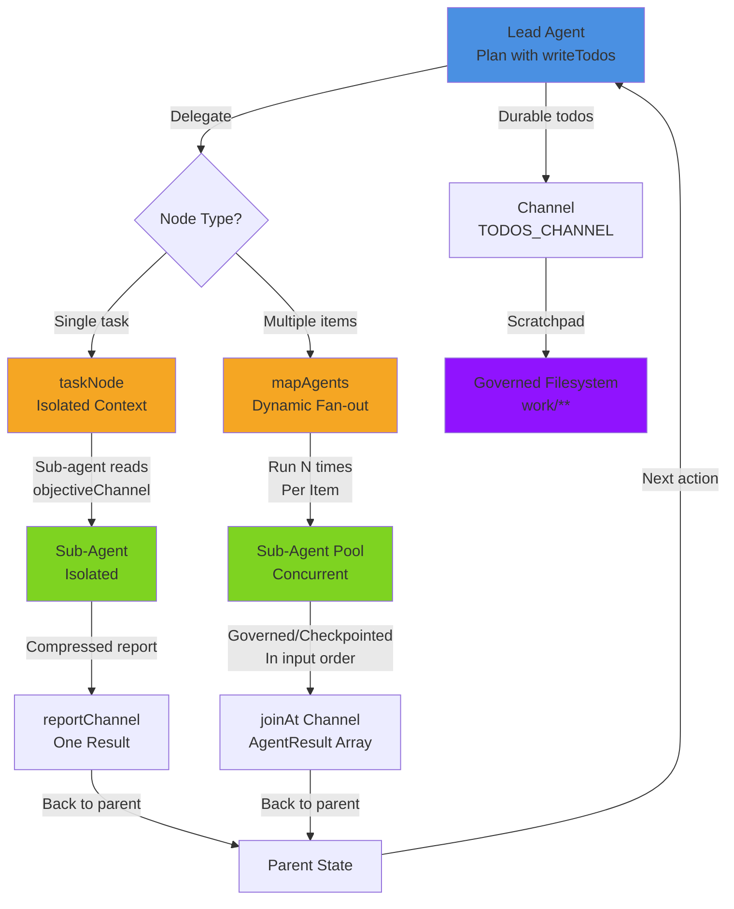

# Deep agents — todos & tasks

A "deep agent" is one that plans its own work, spawns sub-agents for sub-tasks, and keeps a
scratchpad. Adriane gives it three primitives, all of which inherit the runtime's guarantees
(checkpointed, audited, human-gate-preserving):

- **`writeTodos`** — a planning tool that writes a durable todo list.
- **`taskNode`** — spawn a sub-agent in an isolated context that returns one compressed report.
- the **[governed filesystem](./governed-filesystem)** — a scratchpad.

## writeTodos — a durable plan

`writeTodos` is a built-in tool that lets the agent record its plan as a checklist. It is a
**pure tool — never approval-gated**. Add it to the agent's tools and point `todosChannel` at a
durable channel:

```ts
import { createGraph, DefaultLLMGateway, writeTodosTool, TODOS_CHANNEL } from "@adriane-ai/graph-sdk";
import { InMemoryToolRegistry } from "@adriane-ai/graph-sdk";

const tools = new InMemoryToolRegistry();
tools.register(writeTodosTool);

createGraph({ name: "planner" })
  .channel(TODOS_CHANNEL, { type: "json", default: [] })
  .agentNode("plan", {
    llm: new DefaultLLMGateway(),
    prompt: { system: "Break the goal into todos with writeTodos, then start." },
    tools,
    todosChannel: TODOS_CHANNEL   // the authoritative list is persisted here
  })
  .compile();
```

When the agent calls `writeTodos`, the engine captures the normalized list and writes it into the
durable channel **in the same checkpointed update as the result** — so the plan survives a
suspension and downstream nodes can read it. The list also appears on the result as
`AgentResult.todos`.

Each todo is `{ id, text, status }` with `status` one of `pending` / `in_progress` / `completed`.
The normalizer is lenient: it mints one-based ids for missing ones and coerces an unknown status to
`pending`.

## taskNode — isolated sub-agents

`taskNode` spawns a **sub-agent in an isolated context** that returns a single compressed report. It
is sugar over a one-node subgraph, so it inherits everything subgraphs give you: it is checkpointed,
audited, and a sub-agent that suspends for approval suspends the whole run.

```ts
createGraph({ name: "supervisor" })
  .channel("objective", { type: "string", default: "" })
  .channel("report", { type: "json" })
  .taskNode("research", {
    subAgent: {
      llm: new DefaultLLMGateway(),
      prompt: { system: "Research the objective. Return a tight summary." }
    }
  })
  .compile();
```

The isolation is the point: only the `objectiveChannel` is projected **into** the child, and only the
`reportChannel` is projected **back** to the parent. The sub-agent cannot see — or pollute — the
parent's full channel map.

| `taskNode` config field | Type | Default | Meaning |
| --- | --- | --- | --- |
| `subAgent` | `AgentNodeConfig` | — (required) | The sub-agent to spawn (its own ReAct agent config). |
| `objectiveChannel` | `string` | `"objective"` | The only channel projected into the child. |
| `reportChannel` | `string` | `"report"` | The only channel the child's report lands in. |
| `compress` | `boolean` | `true` | Run the sub-agent terse so the report is a summary, not a full transcript. |

## mapAgents — dynamic fan-out

`taskNode` spawns **one** sub-agent. `mapAgents` spawns **N** — one per item in a runtime array,
whose length is known only at run time (ADR 0027 phase 4b). It runs `config.subAgent` once per
item, **concurrently**, and writes the per-item results into `config.joinAt` as an array — **in
input order**, so the run stays deterministic and resumable no matter which spawn finishes first.

```ts
createGraph({ name: "fan-out" })
  .channel("items", { type: "json", default: [] })
  .mapAgents("summarise", {
    overChannel: "items",
    subAgent: {
      llm: new DefaultLLMGateway(),
      prompt: { system: "Summarise this item in one sentence." }
    },
    joinAt: "summaries"
  })
  .compile();
  // -> state.summaries : AgentResult[]
```

Each spawn gets one item as its `input` and **shares the run's channels** as context. This is the
opposite of `taskNode`'s isolation: a `mapAgents` sub-agent sees the common state plus its own
item, where a `taskNode` sub-agent sees only its objective. Reach for `mapAgents` when the work is
the *same job over many inputs* (summarise each document, classify each ticket); reach for
`taskNode` when a sub-task needs a clean, isolated context.

The merge is by **input index**, not by completion time — the result at `joinAt[i]` is always the
sub-agent run for `items[i]`. An absent or non-array `overChannel` produces an empty array and no
spawns (a deterministic no-op). A per-spawn gateway error is captured as `{ error }` at that index
rather than failing the whole node, so one bad item never sinks the batch.

| `mapAgents` config field | Type | Default | Meaning |
| --- | --- | --- | --- |
| `overChannel` | `string` | — (required) | Channel holding the array of items to map the sub-agent over. Auto-declared as a `json` channel defaulting to `[]`. |
| `subAgent` | `AgentNodeConfig` | — (required) | The sub-agent to run per item (its own ReAct agent config). |
| `joinAt` | `string` | — (required) | Channel the array of per-item results lands in — one `AgentResult` per item, in input order. Auto-declared as a `json` channel. |
| `suspendForApproval` | `boolean` | `false` | When true, a spawn that needs approval suspends the **whole** map; resume re-runs it (the granted tools then execute). |
| `label` | `string` | `id` | Display label. |

The human-gate invariant holds across the fan-out: if any spawn flags a gated tool and
`suspendForApproval` is set, the whole map suspends cleanly and a parent `approveAndResume`
re-enters it from the latest checkpoint. The `skills` overlay applies to `mapAgents` sub-agents
too, so each spawn pulls in its own playbook — see [skills](./skills).

### On the catalog path (persisted graphs)

The example above uses the in-process **builder**. A graph authored as data — persisted, or built
in the Studio editor — expresses the same fan-out through a node-metadata **carrier** instead, so no
code is needed. Give any node a `metadata.mapAgents` carrier and the catalog runner
(`runCatalogGraph`) routes it as a dynamic fan-out:

```jsonc
{
  "id": "review-each-pr",
  "type": "agent",
  "metadata": {
    "mapAgents": {
      "overChannel": "pullRequests",   // the array to fan out over
      "joinAt": "reviews",             // where the per-item results land (input order)
      "subAgent": {                    // a full agent carrier — its own provider/model/system/tools,
        "system": "Review this pull request for correctness and risk.",
        "enableFs": true               // and the deep-agent knobs + skills all apply per spawn
      },
      "suspendForApproval": false
    }
  }
}
```

`readMapAgentCarrier` narrows and validates the carrier; a `mapAgents` carrier takes **precedence**
over a plain `agent` carrier on the same node (a fan-out node is not itself a top-level agent). A
carrier that is present but malformed (missing `overChannel` / `joinAt` / `subAgent`) does **not**
silently degrade — the runner warns rather than dropping the node to a no-op. The wire shape matches
the engine's `MapAgentSpec`, so the catalog path reaches full parity with the builder.

`mapAgents` is a native node: it has no TypeScript-fallback handler, so it runs only on the Rust
engine (the required production path). A graph built with it needs the native addon — the TS
dev/test fallback does not back it.

## Putting it together: a deep agent



*Deep-agent loop: lead plans via writeTodos, delegates to taskNode (isolated sub-agent) or mapAgents (N concurrent sub-agents), all checkpointed via governed filesystem.*

A deep agent combines all three: a plan, the filesystem to work in, sub-tasks for the heavy lifting,
and governance throughout. The `governed-deep` [profile](./middleware-and-profiles#profiles) wires the
posture (balanced tier, full efficiency, reflection, suspend-on-approval, filesystem enabled) in one
word — add `writeTodos` and a `taskNode` and you have a governed deep agent:

```ts
const tools = new InMemoryToolRegistry();
tools.register(writeTodosTool);

createGraph({ name: "deep-agent" })
  .fsPolicy([{ glob: "work/**", verb: "write" }])
  .channel(TODOS_CHANNEL, { type: "json", default: [] })
  .agentNode("lead", {
    llm: new DefaultLLMGateway(),
    prompt: { system: "Plan with writeTodos, work under work/, delegate research." },
    tools,
    todosChannel: TODOS_CHANNEL,
    profile: "governed-deep"
  })
  .compile();
```

## Next

- [Middleware & profiles](./middleware-and-profiles)
- [Multi-agent orchestration](/docs/building/multi-agent-orchestration)
- [Subgraphs](/docs/building/subgraphs)
