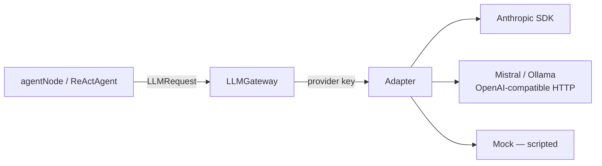

# The LLM Gateway

The LLM Gateway is the **only** part of Adriane allowed to import a provider SDK. Every LLM call
in the system routes through it. Agents never construct an Anthropic client, never hold an API
key, and never hardcode a prompt — they reference a gateway, a capability tier, and a prompt by
id. That single choke point is what makes provider choice, prompt versioning, token accounting,
and offline determinism uniform across every agent and graph.



:::note Which engine actually calls the provider
On the **Rust** path (the default, via `@adriane-ai/napi`) provider calls go through the Rust
`crates/llm-gateway`. The TypeScript `@adriane-ai/llm-gateway` documented here is the
**dev / test / uncovered-platform fallback**: it runs when the native addon is absent, and it is
what the offline mock and the unit tests exercise. The two share the same wire shapes and the
same model-policy table by design — see [one engine, two languages](/docs/sdk-parity/one-engine-two-languages).
Reach the gateway through `@adriane-ai/graph-sdk`, which re-exports these classes; don't import
the engine package directly.
:::

## `DefaultLLMGateway` + `registerAdapter`

`DefaultLLMGateway` is a router, not a client. It holds a `provider -> adapter` map, validates
every request with Zod, then dispatches `complete` / `stream` to the registered adapter for
`req.provider`. You assemble it by registering one adapter per provider you intend to use.

```ts
import {
  DefaultLLMGateway,
  MockLLMProviderAdapter,
  type LLMGateway
} from "@adriane-ai/graph-sdk";

const gateway: LLMGateway = new DefaultLLMGateway();
gateway.registerAdapter(
  new MockLLMProviderAdapter({
    provider: "anthropic",
    response: {
      content: "Paris.",
      usage: { promptTokens: 0, completionTokens: 0 },
      model: "mock",
      provider: "anthropic"
    }
  })
);

const res = await gateway.complete({
  provider: "anthropic",
  model: "claude-opus-4-8",
  messages: [{ role: "user", content: "Capital of France?" }]
});
console.log(res.content);   // "Paris."
console.log(res.provider);  // "anthropic"
```

Expected result: `res.content` is `"Paris."` and `res.provider` is `"anthropic"`.

Two failure modes are typed, never bare throws:

- A request whose `provider` has **no registered adapter** rejects with
  `LLMProviderNotFoundError`.
- A request that fails the Zod schema (empty `model`, empty `messages`, …) rejects with
  `LLMValidationError`, carrying an `issues: string[]`.

```ts
import { LLMProviderNotFoundError } from "@adriane-ai/graph-sdk";

const empty = new DefaultLLMGateway();
await empty
  .complete({ provider: "anthropic", model: "claude-opus-4-8", messages: [{ role: "user", content: "hi" }] })
  .catch((e) => console.log(e instanceof LLMProviderNotFoundError)); // true
```

Expected result: prints `true` — no adapter was registered for `"anthropic"`.

## The request and response shapes

A request (`LLMRequest`, in `packages/llm-gateway/src/types.ts`) carries a `provider`, a `model`
id, an array of `messages`, and optionally `system`, `tools`, `maxTokens`, `temperature`,
`stream`. Messages are either plain strings or arrays of content blocks — `text`, `tool_use`,
`tool_result` — so a tool-calling agent holds a real multi-turn conversation instead of stuffing
observations into text.

The response (`LLMResponse`) is `{ content, toolCalls?, stopReason?, usage, model, provider }`.
`usage` reports `promptTokens` / `completionTokens` and, where the provider supports prompt
caching, `cacheReadTokens` / `cacheWriteTokens`.

:::note The system prompt and tool list are the cacheable prefix
`system` and `tools` are meant to be byte-stable across calls so the provider can cache that
prefix. Keep volatile values (dates, timestamps, session ids) **out** of `system` and pass them
in the per-call user message instead. The Anthropic adapter places cache breakpoints on the
system block and the last tool accordingly (`packages/llm-gateway/src/anthropic-adapter.ts`).
:::

## Provider adapters

An adapter implements `LLMProviderAdapter`: a `provider` key plus `complete` and `stream`. Each
adapter isolates one provider's SDK or HTTP shape behind an injectable "port", so the
request/response mapping is unit-tested without a network call or an API key.

| Adapter | Provider key | Talks to | Notes |
| --- | --- | --- | --- |
| `AnthropicProviderAdapter` | `anthropic` | `@anthropic-ai/sdk` | Cache breakpoints on system + last tool. Drops `temperature`/`top_p` (Opus 4.7/4.8 reject them). Default model `claude-opus-4-8`. |
| `OpenAICompatibleProviderAdapter` | `mistral` | `/v1/chat/completions` over `fetch` | One class for any OpenAI-shaped server. `.mistral(apiKey)` for Mistral cloud, `.ollama()` for a keyless local Ollama. |
| `MockLLMProviderAdapter` | any | nothing | Returns scripted responses. No SDK, no key, no network. |

Note that **Ollama registers under the `mistral` provider key** — it routes through the same
gateway slot as Mistral cloud, because both speak the OpenAI chat shape
(`packages/llm-gateway/src/openai-compatible-adapter.ts`).

```ts
import {
  DefaultLLMGateway,
  AnthropicProviderAdapter,
  OpenAICompatibleProviderAdapter
} from "@adriane-ai/graph-sdk";

const gateway = new DefaultLLMGateway();
gateway.registerAdapter(new AnthropicProviderAdapter({ apiKey: process.env.ANTHROPIC_API_KEY }));
gateway.registerAdapter(OpenAICompatibleProviderAdapter.mistral(process.env.MISTRAL_API_KEY));
// Local, keyless:
gateway.registerAdapter(OpenAICompatibleProviderAdapter.ollama());
```

Expected result: a gateway that routes `anthropic` requests to the Anthropic SDK and `mistral`
requests to the OpenAI-compatible HTTP transport.

:::warning No `openai` adapter ships
`"openai"` is a valid provider in the request schema, but no first-party OpenAI adapter is
included — only Anthropic, the OpenAI-compatible class (used for Mistral/Ollama), and the mock.
A request with `provider: "openai"` and no registered adapter rejects with
`LLMProviderNotFoundError`. Streaming on the OpenAI-compatible adapter is **not** incremental SSE:
it completes once, then surfaces the whole text as a single delta followed by a terminal chunk.
:::

:::note Broader provider support on the Rust engine
The live **Rust** gateway (the default execution path — see ADR 0005) ships
a wider provider set than this TypeScript fallback: a **native Google Gemini** adapter (the
`generateContent` API), plus the OpenAI-compatible family — **OpenAI, OpenRouter, MiniMax,
Hugging Face, LM Studio** alongside Mistral and Ollama. Each new provider is an enum slot + a
constructor (one adapter covers the whole OpenAI-shaped family); selection is by which env
credential is present — `OPENAI_API_KEY`, `GEMINI_API_KEY` / `GOOGLE_API_KEY`,
`OPENROUTER_API_KEY`, `MINIMAX_API_KEY`, `HF_TOKEN`, `ADRIANE_USE_OLLAMA=1`,
`ADRIANE_USE_LMSTUDIO=1`. This "bring your own model" posture is what lets a deployment stay on
hosted EU models or run fully on-premise with local models. The deprecated TS gateway here stays
at two adapters by design.
:::

## The capability-tier model policy

Agents declare a **capability tier**, not a model id. `ModelPolicy`
(`packages/llm-gateway/src/model-policy.ts`) maps an abstract tier onto a concrete
`{ provider, model }` given the providers that are actually available. The four tiers:

- `frontier` — the strongest model
- `balanced` — the everyday default
- `fast` — cheap and quick
- `creative` — tuned for generative writing

The shared default table (mirrored byte-for-byte in the Rust crate):

| Tier | `anthropic` | `mistral` | `ollama` |
| --- | --- | --- | --- |
| `frontier` | `claude-opus-4-8` | `mistral-large-latest` | `mistral` |
| `balanced` | `claude-sonnet-4-6` | `mistral-medium-latest` | `mistral` |
| `fast` | `claude-haiku-4-5` | `mistral-small-latest` | `mistral` |
| `creative` | `claude-fable-5` | `mistral-large-latest` | `mistral` |

`availableFromEnv()` reads the process env to decide which providers are usable:
`anthropic` iff `ANTHROPIC_API_KEY` is set, `mistral` iff `MISTRAL_API_KEY` is set, `ollama` iff
`ADRIANE_USE_OLLAMA=1`. The result is ordered by the default preference
`["anthropic", "mistral", "ollama"]`.

`resolve(tier, available, override?)` then picks the highest-preference available provider that
can serve the tier:

```ts
import { ModelPolicy } from "@adriane-ai/graph-sdk";

const policy = new ModelPolicy();

// Pretend only Mistral has a key:
policy.resolve("frontier", ["mistral"]);
// → { provider: "mistral", model: "mistral-large-latest", recommended: true }

// Anthropic available, want the cheap tier:
policy.resolve("fast", ["anthropic"]);
// → { provider: "anthropic", model: "claude-haiku-4-5", recommended: true }

// Nothing available at all → mock fallback:
policy.resolve("balanced", []);
// → { provider: "mock", model: "mock-model", recommended: false }
```

Expected result: each `resolve` returns the `ModelChoice` shown in the comment. `recommended` is
`true` only when the model came from the policy's per-tier default.

**An explicit model always wins.** Passing an override marks the choice `recommended: false` and
takes precedence over the tier:

```ts
policy.resolve("fast", ["anthropic"], { model: "claude-opus-4-8" });
// → { provider: "anthropic", model: "claude-opus-4-8", recommended: false }
```

Expected result: the override `model` is used verbatim; the `fast` tier default
(`claude-haiku-4-5`) is ignored.

:::note Where the tier is resolved depends on the engine
On the **Rust** path the bridge resolves the tier from the process env inside
`crates/llm-gateway`. On the **TS fallback** path the SDK's `resolveAgentModel` calls
`ModelPolicy` here (`packages/graph-sdk/src/agent-node.ts`). Same table, same rule: explicit
model wins, then tier-against-available, then the mock fallback.
:::

## The prompt registry — id + version, never hardcoded

Prompts are versioned artifacts, not string literals buried in agent code. `PromptRegistry`
(`packages/llm-gateway/src/prompt-registry.ts`) stores `PromptTemplate`
(`{ id, version, system, description? }`) and resolves a template by `id` plus an optional
`version`. With no version, `get` returns the **most recently registered** version. An unknown
id or version throws `PromptNotFoundError`.

```ts
import { InMemoryPromptRegistry } from "@adriane-ai/graph-sdk";

const prompts = new InMemoryPromptRegistry();
prompts.register({ id: "qa.system", version: "1.0.0", system: "Answer in one sentence." });
prompts.register({ id: "qa.system", version: "2.0.0", system: "Answer in one word." });

prompts.get("qa.system").system;          // "Answer in one word."  (latest)
prompts.get("qa.system", "1.0.0").system;  // "Answer in one sentence."
```

Expected result: the version-less `get` resolves to `2.0.0` (last registered); pinning `1.0.0`
returns the older template.

Even an **inline** agent prompt is referenced by id, never hardcoded into the agent. When you
pass `prompt: { system: "…" }` to `agentNode`, the SDK registers that string under a
deterministic id (`sdk.agent.<nodeId>.system`, version `1.0.0`) and hands the agent a reference
— so every agent goes through the registry uniformly (`resolvePrompt` in
`packages/graph-sdk/src/agent-node.ts`).

## How `agentNode` consumes a gateway

`agentNode` doesn't call the gateway directly; it builds a `ReActAgent` and hands it the gateway,
the resolved `{ provider, model }`, and the prompt **reference** (`promptRegistry` + `promptId` +
`promptVersion`). The agent fetches the system prompt from the registry and issues
`gateway.complete(...)` calls through its reasoning loop.

```ts
import {
  createGraph,
  DefaultLLMGateway,
  MockLLMProviderAdapter,
  type LLMGateway
} from "@adriane-ai/graph-sdk";

const mockLLM = (): LLMGateway => {
  const g = new DefaultLLMGateway();
  g.registerAdapter(
    new MockLLMProviderAdapter({
      provider: "anthropic",
      response: {
        content: "FINAL: Paris.",
        usage: { promptTokens: 0, completionTokens: 0 },
        model: "mock",
        provider: "anthropic"
      }
    })
  );
  return g;
};

const app = createGraph({ name: "qa" })
  .agentNode("assistant", {
    llm: mockLLM(),
    prompt: { system: "Answer. Prefix the final answer with FINAL:." },
    tier: "balanced",
    maxIterations: 2
  })
  .compile();

const result = await app.run({});
console.log(result.status);                         // "completed"
console.log(result.channels.agentResult.reasoning); // ReAct trace
```

Expected result: `result.status` is `"completed"` and `result.channels.agentResult` holds the
agent's `AgentResult`. See [agent nodes & ReAct](/docs/building/agent-nodes-and-react) for the
full `agentNode` config and routing on the result.

## Offline determinism with `MockLLMProviderAdapter`

`MockLLMProviderAdapter` is the reason the whole framework runs with **no API key**: it returns
scripted responses, so an agent's reasoning loop is fully deterministic and replayable. Two
modes:

- `response` — a single `LLMResponse` returned on every `complete()` call.
- `responses` — an **array** replayed one per call, the last repeating once exhausted. This
  drives a multi-turn agent: e.g. a first turn that emits a `tool_use`, then a final-answer turn.

```ts
import { DefaultLLMGateway, MockLLMProviderAdapter } from "@adriane-ai/graph-sdk";

const gateway = new DefaultLLMGateway();
gateway.registerAdapter(
  new MockLLMProviderAdapter({
    provider: "anthropic",
    responses: [
      { content: "ACTION: search {}", usage: { promptTokens: 0, completionTokens: 0 }, model: "mock", provider: "anthropic" },
      { content: "FINAL: done", usage: { promptTokens: 0, completionTokens: 0 }, model: "mock", provider: "anthropic" }
    ]
  })
);

const req = { provider: "anthropic" as const, model: "mock", messages: [{ role: "user" as const, content: "go" }] };
console.log((await gateway.complete(req)).content); // "ACTION: search {}"
console.log((await gateway.complete(req)).content); // "FINAL: done"
console.log((await gateway.complete(req)).content); // "FINAL: done"  (last repeats)
```

Expected result: the first two calls return the two scripted turns in order; the third (and any
further) call repeats the last response.

:::note This is how the prebuilt agents run by default
Every `prebuilt.*` agent (and the `agentNode` examples) defaults to a `DefaultLLMGateway` +
`MockLLMProviderAdapter`, so they run offline out of the box. For an approval-gated prebuilt the
mock even scripts an `ACTION: <tool> {}` turn so the suspend-for-approval gate fires
deterministically (`resolveGateway` in `packages/graph-sdk/src/prebuilt-agents.ts`). Swap in a
real adapter only when you want live calls.
:::

## Next

- [Agent nodes & ReAct](/docs/building/agent-nodes-and-react)
- [One engine, two languages](/docs/sdk-parity/one-engine-two-languages)
