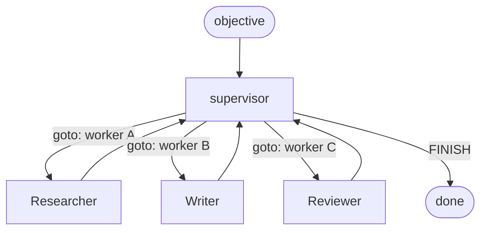

# Multi-agent orchestration

A single [agent node](./agent-nodes-and-react) reasons, calls tools, and writes an `AgentResult`
to a channel. The interesting work is **composing several of them**: chaining one agent's output
into the next, routing between agents on the result, and delegating from a coordinator to workers.

In Adriane you orchestrate agents the same way you orchestrate anything else — **as nodes and
edges in a graph**. There is no separate "multi-agent runtime": every agent node checkpoints
after it completes, emits a lifecycle event, and can suspend at a human gate, exactly like an
action node (see [the execution contract](/docs/core-concepts/execution-contract)). That is what
makes a multi-agent run resumable and auditable rather than a fire-and-forget fan-out.

Everything below uses the public builder from `@adriane-ai/graph-sdk`.

:::note Where the named patterns live
"Supervisor", "swarm", "plan-execute", "reflection", "self-correction", and "coordination" exist
as classes/helpers in `@adriane-ai/agents-core` (`SupervisorAgent`, `createSwarmHandoff`,
`PlannerAgent`/`ExecutorAgent`, `createReflectionNode`, `SelfCorrectionWrapper`,
`AgentCoordinator`). Those classes are **internal to `@adriane-ai/agents-core` and not
re-exported from the SDK** — agent execution runs on the Rust engine driven through
`@adriane-ai/graph-sdk`. So the supported, public way to express each pattern is the
**graph-level composition** shown on this page: agent nodes wired with `edge` / `conditionalEdge`
(and `Command{goto}` for dynamic routing). Where a pattern exists only as an internal class, this
page says so and shows the graph form instead.
:::

All snippets run offline on a deterministic mock gateway — no API key. The helper is the same one
used throughout the docs:

```ts
import { DefaultLLMGateway, MockLLMProviderAdapter, type LLMGateway } from "@adriane-ai/graph-sdk";

const mockLLM = (content: string): LLMGateway => {
  const gateway = new DefaultLLMGateway();
  gateway.registerAdapter(
    new MockLLMProviderAdapter({
      provider: "anthropic",
      response: { content, usage: { promptTokens: 0, completionTokens: 0 }, model: "mock", provider: "anthropic" }
    })
  );
  return gateway;
};
```

## 1. Sequential chaining (agent → agent)

Wire one agent node into the next with a plain `edge`. Each agent writes to its **own** output
channel (`outputChannel`), so the second agent can read the first's result off state.

```ts
import { createGraph, DefaultLLMGateway, MockLLMProviderAdapter, type LLMGateway } from "@adriane-ai/graph-sdk";

const mockLLM = (content: string): LLMGateway => {
  const gateway = new DefaultLLMGateway();
  gateway.registerAdapter(
    new MockLLMProviderAdapter({
      provider: "anthropic",
      response: { content, usage: { promptTokens: 0, completionTokens: 0 }, model: "mock", provider: "anthropic" }
    })
  );
  return gateway;
};

const app = createGraph({ name: "research-then-write" })
  .agentNode("researcher", {
    llm: mockLLM("FINAL: GDP grew 2.1% last quarter."),
    prompt: { system: "Gather the key facts. Prefix the final answer with FINAL:." },
    outputChannel: "research"
  })
  .agentNode("writer", {
    llm: mockLLM("FINAL: Last quarter, GDP grew 2.1%."),
    prompt: { system: "Write a one-line summary from the research in state." },
    outputChannel: "draft"
  })
  .edge("researcher", "writer")
  .compile();

const result = await app.run({});
console.log(result.status);                       // "completed"
console.log(result.channels.research.reasoning);  // researcher's trace
console.log(result.channels.draft.reasoning);     // writer's trace
```

**Expected result:** `status === "completed"`; both `research` and `draft` channels hold an
`AgentResult`. The `researcher` node checkpoints before `writer` starts, so a crash between them
resumes at `writer` without re-running the researcher.

:::note Passing data between agents
An agent node reads the whole `state.channels` as part of its input context — it does **not**
automatically receive the previous agent's `AgentResult` as a prompt variable. To feed a specific
field forward (e.g. the researcher's text into the writer's prompt), put an action node between
them that projects `state.channels.research` into a plain channel the next agent's system prompt
references. The `AgentResult` shape (`{ artifacts, blockers, approvalRequests, confidence,
reasoning, requiresHumanReview }`) is defined in `packages/agents-core/src/types.ts`.
:::

## 2. Routing between agents on the result

Because each agent writes a typed `AgentResult`, you route on it with `conditionalEdge`. The two
fields you'll branch on most are `confidence` (a number) and `requiresHumanReview` (a boolean,
set true when the agent hit an approval-gated tool).

```ts
const app = createGraph({ name: "triage-route" })
  .agentNode("triage", {
    llm: mockLLM("FINAL: refund the customer"),
    prompt: { system: "Decide the action. Prefix the final answer with FINAL:." },
    outputChannel: "decision"
  })
  .humanGate("review")
  .agentNode("specialist", {
    llm: mockLLM("FINAL: escalated and handled"),
    prompt: { system: "Handle the hard cases." },
    outputChannel: "specialistResult"
  })
  .node("auto", async () => ({ done: true }))
  // Flagged for review → human gate (suspends the run).
  .conditionalEdge("triage", "review", "needsReview", (s) => s.channels.decision.requiresHumanReview)
  // Low confidence → hand to a specialist agent.
  .conditionalEdge(
    "triage",
    "specialist",
    "lowConfidence",
    (s) => !s.channels.decision.requiresHumanReview && s.channels.decision.confidence < 0.6
  )
  // Otherwise auto-handle.
  .conditionalEdge(
    "triage",
    "auto",
    "confident",
    (s) => !s.channels.decision.requiresHumanReview && s.channels.decision.confidence >= 0.6
  )
  .compile();
```

**Expected result:** the three guarded edges out of `triage` are evaluated **in order**; the
first whose predicate holds is followed. A run that routes into `review` suspends with status
`suspended` and resumes from the latest checkpoint after approval (see
[resumability and approvals](/docs/core-concepts/resumability-and-approvals)).

:::warning Conditions are named predicates, not `eval`'d strings
`conditionalEdge(from, to, name, predicate)` registers the predicate under `name`; the engine
never compiles a user-supplied string. This is a hard determinism guarantee — see
[the execution contract](/docs/core-concepts/execution-contract).
:::

:::note The ReAct agent reports a fixed confidence
On the TS fallback path, `ReActAgent` returns `confidence: 0.7` and sets `requiresHumanReview`
only when an approval-gated tool was hit (`packages/agents-core/src/react-agent.ts`). So
`confidence`-based routing is most useful with custom agent handlers or the Rust agent path that
emit a real score; `requiresHumanReview` is reliable on both paths.
:::

## 3. Supervisor pattern (coordinator delegates to workers)

A **supervisor** is an agent that, given an objective, picks which worker to run next, and
repeats until it decides `FINISH`. In Adriane this is a graph: a supervisor node that returns a
`Command { goto }` to jump to the chosen worker node, with each worker looping back to the
supervisor.



The supervisor node returns a `Command` to route. `Command` is
`{ goto: NodeId | NodeId[]; update? }` (`packages/graph-core/src/types.ts`) and any node handler
may return one to override edge resolution and jump explicitly.

```ts
import { createGraph, type Command } from "@adriane-ai/graph-sdk";

const app = createGraph({ name: "supervisor", recursionLimit: 12 })
  .channel("objective", { type: "string", default: "" })
  .channel("rounds", { type: "number", default: 0 })
  .channel("log", { type: "string[]", reducer: "append", default: [] })
  // The supervisor decides the next worker (or finishes) and bumps the round counter.
  .node("supervisor", async (_input, state): Promise<Command> => {
    const rounds = state.channels.rounds;
    if (rounds >= 3 || state.channels.log.length >= 2) {
      return { goto: "done" };
    }
    const next = rounds === 0 ? "researcher" : "writer";
    return { goto: next, update: { rounds: rounds + 1 } };
  })
  .agentNode("researcher", {
    llm: mockLLM("FINAL: facts gathered"),
    prompt: { system: "Research the objective." },
    outputChannel: "research"
  })
  .agentNode("writer", {
    llm: mockLLM("FINAL: drafted"),
    prompt: { system: "Write from the research." },
    outputChannel: "draft"
  })
  .node("done", async () => ({}))
  // Workers report back to the supervisor; the supervisor's Command does the routing,
  // so these are the "loop back" edges.
  .edge("researcher", "supervisor")
  .edge("writer", "supervisor")
  .compile();

const result = await app.run({ objective: "Quarterly memo" });
console.log(result.status); // "completed"
```

**Expected result:** the supervisor alternates `researcher` → `writer` and then routes to `done`.
The `recursionLimit` bounds the loop so a misbehaving supervisor can't spin forever — it stops
with a typed error instead.

:::note `SupervisorAgent` is a deprecated-engine class
`@adriane-ai/agents-core` ships a `SupervisorAgent` whose `nextCommand(...)` asks the LLM to reply
`AGENT:<id>` or `FINISH` and returns a `Command` to the mapped worker node, capped by
`config.maxRounds` (`packages/agents-core/src/supervisor.ts`). It is **not exported from the SDK**.
The graph form above is the supported equivalent: a node that returns the routing `Command`. If
you want the LLM to choose the worker, have the supervisor node `complete()` against your gateway
and map the reply to a `goto` — exactly what `SupervisorAgent` does internally.
:::

## 4. Swarm / handoff pattern (peer-to-peer)

A **swarm** has no central coordinator: each agent decides whether to hand control to a peer. The
handoff is again just a `Command { goto }` — the agent that wants to delegate routes directly to
the peer node.

```ts
const app = createGraph({ name: "swarm", recursionLimit: 10 })
  .channel("reason", { type: "string", default: "" })
  // Front-line agent: handles simple cases, hands off the rest by routing to "specialist".
  .node("frontline", async (_input, state): Promise<Command> => {
    const needsSpecialist = state.channels.reason === "complex";
    return needsSpecialist
      ? { goto: "specialist", update: { reason: "handed off: complex case" } }
      : { goto: "resolve" };
  })
  .agentNode("specialist", {
    llm: mockLLM("FINAL: specialist resolution"),
    prompt: { system: "You handle complex cases handed off by the frontline." },
    outputChannel: "specialistResult"
  })
  .node("resolve", async () => ({ resolved: true }))
  .edge("specialist", "resolve")
  .compile();
```

**Expected result:** the `frontline` node either resolves directly or hands off to `specialist`
by returning `goto: "specialist"`. The handoff is a checkpointed transition — the run can suspend
and resume mid-swarm.

:::note `createSwarmHandoff` is a typed payload, not a runtime mechanism
`@adriane-ai/agents-core` exports `createSwarmHandoff(goto, reason)` and `isSwarmHandoff(value)`,
which build/validate a `{ type: "swarm_handoff", goto, update: { reason } }` object
(`packages/agents-core/src/swarm.ts`). It is a serializable handoff descriptor for the deprecated
engine — it does **not** itself reroute the graph and is not exported from the SDK. To actually
hand off in a graph, return a `Command { goto }` as shown above (you can stash the `reason` in
`update`).
:::

### Parallel workers (coordination / fan-out)

To run several agents **concurrently** and join their results, fan out by returning a `Command`
whose `goto` is an **array** of node ids (`goto: NodeId | NodeId[]`), then join at a downstream
node that reads each worker's output channel.

```ts
const app = createGraph({ name: "fan-out" })
  .channel("topic", { type: "string", default: "" })
  .node("dispatch", async (): Promise<Command> => ({ goto: ["legal", "finance"] }))
  .agentNode("legal", {
    llm: mockLLM("FINAL: no legal blockers"),
    prompt: { system: "Review for legal risk." },
    outputChannel: "legalReview"
  })
  .agentNode("finance", {
    llm: mockLLM("FINAL: budget approved"),
    prompt: { system: "Review the budget." },
    outputChannel: "financeReview"
  })
  .node("join", async (_input, state) => ({
    combined: [state.channels.legalReview.reasoning, state.channels.financeReview.reasoning]
  }))
  .edge("legal", "join")
  .edge("finance", "join")
  .compile();
```

**Expected result:** `legal` and `finance` both run off the fan-out, then `join` reads both result
channels. Because each agent writes a **distinct** output channel, there is no write conflict; if
two parallel agents must write the **same** channel, declare it with an append/merge reducer (see
[channels and reducers](/docs/core-concepts/channels-and-reducers)).

:::note `AgentCoordinator` is a deprecated-engine helper
`@adriane-ai/agents-core` ships `AgentCoordinator.runParallel(tasks, ...)`, which runs agents with
`Promise.all`, averages their `confidence`, concatenates `reasoning`, and reports conflicting
`proposedUpdate` keys as a `conflicts` array (`packages/agents-core/src/coordination.ts`). It is
**not exported from the SDK**. The graph-level fan-out above is the supported equivalent and gives
you the same parallelism with checkpointing and conflict handling via reducers instead of an
in-memory merge.
:::

## 5. Plan-execute

A **planner** turns an objective into steps; an **executor** runs them. As a graph: a planner
agent writes a plan into a channel, then an executor node iterates it.

```ts
const app = createGraph({ name: "plan-execute" })
  .channel("objective", { type: "string", default: "" })
  .channel("steps", { type: "string[]", default: [] })
  .channel("results", { type: "string[]", reducer: "append", default: [] })
  // Planner: an agent produces a plan; an action node projects it into the `steps` channel.
  .agentNode("planner", {
    llm: mockLLM("FINAL: 1. gather data 2. summarize"),
    prompt: { system: "Produce a numbered plan for the objective." },
    outputChannel: "plan"
  })
  .node("parse-plan", async (_input, state) => ({
    steps: state.channels.plan.reasoning
      .split(/\d+\.\s*/)
      .map((s) => s.trim())
      .filter((s) => s.length > 0)
  }))
  // Executor: run each step (here a deterministic stub).
  .node("execute", async (_input, state) => ({
    results: state.channels.steps.map((step) => `did: ${step}`)
  }))
  .edge("planner", "parse-plan")
  .edge("parse-plan", "execute")
  .compile();
```

**Expected result:** `planner` emits a plan, `parse-plan` projects it into `steps`, `execute`
produces one result per step. Splitting plan and execution into separate nodes means a long
execution can suspend and resume per checkpoint rather than as one opaque agent call.

:::note `PlannerAgent` / `ExecutorAgent` are deprecated-engine classes
`@adriane-ai/agents-core` ships `PlannerAgent` (splits the LLM reply into `{ id, text }` steps and
stores them in the memory store) and `ExecutorAgent` (runs each step via an injected `executeStep`
fn) — `packages/agents-core/src/plan-execute.ts`. Neither is exported from the SDK. The graph form
above keeps the same plan→execute separation using nodes and channels.
:::

## 6. Reflection & self-correction

**Reflection** loops an agent's output back through a critique step; **self-correction** re-runs
the agent with feedback when its result is weak. Both are loops, bounded by the
[`recursionLimit`](/docs/core-concepts/execution-contract).

Graph form — a critique node routes back to the agent until it's satisfied or a counter is hit:

```ts
const app = createGraph({ name: "reflection", recursionLimit: 8 })
  .channel("attempts", { type: "number", default: 0 })
  .agentNode("draft", {
    llm: mockLLM("FINAL: a first draft"),
    prompt: { system: "Draft an answer." },
    outputChannel: "draft"
  })
  .node("critique", async (_input, state): Promise<Command> => {
    const attempts = state.channels.attempts;
    const goodEnough = state.channels.draft.confidence >= 0.7 || attempts >= 2;
    return goodEnough ? { goto: "publish" } : { goto: "draft", update: { attempts: attempts + 1 } };
  })
  .node("publish", async () => ({ published: true }))
  .edge("draft", "critique")
  .compile();
```

**Expected result:** `critique` either publishes or loops back to `draft`, bumping `attempts`.
The loop is cyclic-by-design and the `recursionLimit` guarantees termination.

:::note `createReflectionNode` and `SelfCorrectionWrapper` are deprecated-engine helpers
`@adriane-ai/agents-core` exports `createReflectionNode({ llm, previousNodeId, maxReflections })`,
a `NodeHandler` that critiques the prior output and returns a `Command` back to `previousNodeId`
when the critique mentions "problem"/"retry" (capped by `maxReflections`, default 2) —
`packages/agents-core/src/reflection-node.ts`. `SelfCorrectionWrapper` wraps an agent and re-runs
it (up to `maxCorrections`, default 2) while `confidence < minConfidence` or there are blockers,
feeding the prior result back as `feedback` — `packages/agents-core/src/self-correction.ts`.
Neither is exported from the SDK; reproduce the loop at the graph level as above.
:::

## What you get for free

Because every agent is a node, multi-agent runs inherit the full
[execution contract](/docs/core-concepts/execution-contract):

- **Checkpointed between agents** — a crash between two agents resumes at the second, with no
  re-run of the first and no repeated side effects.
- **One event per transition** — the [event journal](/docs/governance/observable-runs) is the
  audit trail of which agent ran when, including handoffs and supervisor decisions.
- **Suspend/resume at any gate** — route on `requiresHumanReview` into a `humanGate` and the whole
  multi-agent run suspends cleanly, then resumes from the latest checkpoint (see
  [approval gates](/docs/governance/approval-gates)). An agent **never approves its own output** —
  review is always a different principal.
- **Bounded loops** — `recursionLimit` (set via `createGraph({ recursionLimit })`) bounds
  supervisor/reflection cycles so they always terminate.

## 7. LLM Council (governed deliberation)

A **council** dispatches a query to N member agents, has reviewers **rank the anonymized field**, and
a **chair** synthesizes the final answer — a governed version of Karpathy's llm-council (ADR 0013).
`council(...)` builds the **catalog graph** for you — every node carries a component/agent carrier
(anonymize/aggregate are the `councilAnonymize` / `councilAggregate` Rust components), so it runs on
the Rust engine via `runCatalogGraph` like any governed graph:

```ts
import { council, runCatalogGraph, openai, anthropic } from "@adriane-ai/graph-sdk";

const definition = council({
  members: [
    { model: openai("gpt-4o"), prompt: { system: "Answer the question." } },
    { model: anthropic("claude-sonnet-4-5"), prompt: { system: "Answer the question." } },
    { model: openai("gpt-4o-mini"), prompt: { system: "Answer the question." } }
  ],
  // reviewers default to one per member; each ranks the ANONYMIZED answers (it can't favour its own)
  chair: { model: anthropic("claude-sonnet-4-5"), prompt: { system: "Synthesize the best answer." } },
  humanGate: true // optional: suspend for accept/override before the chair (high-stakes)
});

const result = await runCatalogGraph(definition, { initialData: { query: "How should we price the EU tier?" } });
```

The graph is `dispatch → members (fan-out) → anonymize+shuffle → reviewers (fan-out, rank) →
aggregate (Borda) → [human gate] → chair`. What Adriane adds over a script: **checkpoint after every
seat** (a timed-out member resumes without re-paying the others), a **node event per member/reviewer/
chair** (who answered, who ranked whom, what the chair used — a signable audit trail), **no
self-review** (a member never reviews its own answer), and an **optional human gate** before the
verdict. The anonymize + aggregate steps are deterministic (replay-faithful). N is fixed by the member
list. Cost is N× — reserve it for high-stakes questions.

## Next

- [Agent nodes & ReAct](./agent-nodes-and-react)
- [Tools and tool nodes](./tools-and-tool-nodes)
- [Approval gates](/docs/governance/approval-gates)
