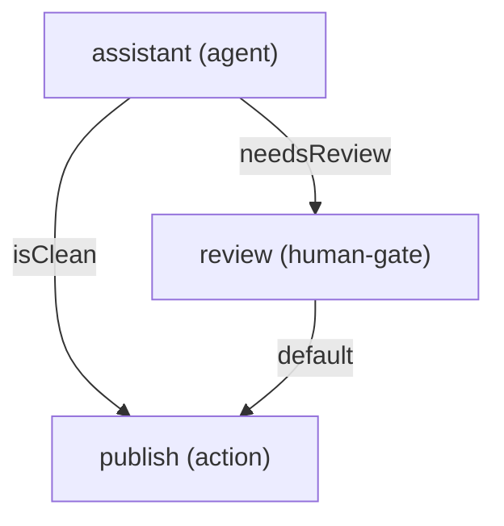

# Graph YAML syntax

The graph DSL is YAML that compiles into a `GraphDefinition` — the **same wire format** the
[`@adriane-ai/graph-sdk`](/docs/building/action-nodes-and-routing) builder produces. Either path
feeds the same engine. Reach for YAML when the **shape** of the graph is the artifact you want
to store, review, and diff; reach for the builder when you need real handler code.

A graph document mirrors the `GraphDefinition` fields one-to-one:

```yaml
id: graph-1
version: 1.0.0
name: Demo graph
entryNodeId: n1
recursionLimit: 25   # optional
channels:
  messages:
    type: messages
    reducer: append
nodes:
  - id: n1
    type: action
    label: Start
edges: []
```

The compiler builds an AST (`buildGraphAST`), validates it (`validateGraphAST`), then transforms
it into a `GraphDefinition` (`transformGraph`). Source:
`packages/graph-adriane/src/parser/build-graph-ast.ts`.

:::warning Structure, not behavior
The graph DSL declares node **structure** only — the node's `id`, `type`, and `label`. It does
**not** carry agent behavior: an agent node has no `llm`, `prompt`, `tools`, or `tier` field in
YAML. That behavior is attached out-of-band — by the SDK builder's `.agentNode(id, config)`, or by
an [agent DSL document](/docs/dsl/prompt-agent-chain-syntax) referenced by id. A graph YAML file
captures the graph's topology; it is not a self-contained runnable agent.
:::

## Top-level fields

| Field | Type | Required | Notes |
| --- | --- | --- | --- |
| `id` | string | yes | Graph id. Defaults to `""` if missing (then fails validation downstream). |
| `version` | string | yes | Semver string, e.g. `1.0.0`. |
| `name` | string | yes | Human-readable name. |
| `entryNodeId` | string | yes | The node the run starts at. Must match a node `id`. |
| `recursionLimit` | number | no | Bound on cyclic execution. Required (as a warning) when the graph has a cycle. |
| `channels` | map | no | Channel name → definition. Defaults to `{}`. |
| `nodes` | list | no | Node definitions. Defaults to `[]`. |
| `edges` | list | no | Edge definitions. Defaults to `[]`. |

The parser is **tolerant**: missing or wrongly-typed top-level fields are coerced to empty
defaults (e.g. a non-string `id` becomes `""`, a non-array `nodes` becomes `[]`). The
[validator](#validation-failures) is what rejects a malformed graph, not the parser.

## Channels

A channel is a typed slot of run state plus the reducer that merges writes to it. In YAML,
`channels` is a **map** of channel name → definition.

| Field | Type | Default | Notes |
| --- | --- | --- | --- |
| `type` | string | `"unknown"` | A label only (e.g. `messages`, `number`, `object`). Not enforced at compile time. |
| `reducer` | `replace` \| `append` \| `merge` | `replace` | How concurrent/sequential writes combine. Anything else is normalized to `replace`. |
| `default` | any | — | Initial value before any write. Passed through as-is. |

```yaml
channels:
  messages:
    type: messages
    reducer: append      # appended to, never overwritten
  amount:
    type: number
    reducer: replace
    default: 0
  context:
    type: object
    reducer: merge       # shallow-merged
    default: {}
```

See [channels and reducers](/docs/core-concepts/channels-and-reducers) for reducer semantics.

## Nodes

Each entry in `nodes` is a node definition.

| Field | Type | Default | Notes |
| --- | --- | --- | --- |
| `id` | string | `""` | Node id, referenced by edges and `entryNodeId`. |
| `type` | `action` \| `agent` \| `tool` \| `human-gate` \| `subgraph` | `action` | Unknown values normalize to `action`. |
| `label` | string | `""` | Display label. |
| `graph` | string | — | **Only** read for `subgraph` nodes: a `name@version` ref (see [subgraph](#subgraph)). |

There is no `handler`, `prompt`, or `tool` field — see the warning above. A worked example per
node type follows.

### `action`

The workhorse node. In YAML it is pure structure; the real async handler is attached by the
builder's `.node(id, handler)`.

```yaml
nodes:
  - id: publish
    type: action
    label: Publish artifact
```

### `agent`

A ReAct agent node. The YAML declares only that node `assistant` is of type `agent` — the
`llm` / `prompt` / `tools` / `tier` live in the SDK config or the agent DSL.

```yaml
nodes:
  - id: assistant
    type: agent
    label: Drafting agent
```

### `human-gate`

A node that suspends the run (`run_suspended`) until a human resumes it. See
[approval gates](/docs/governance/approval-gates).

```yaml
nodes:
  - id: review
    type: human-gate
    label: Editor review
```

### `tool`

A node that executes a registered tool over the message channel.

```yaml
nodes:
  - id: tools
    type: tool
    label: Tool runner
```

### `subgraph`

A node that references another graph by `name@version`. The `graph` field is parsed by
`parseVersionedRef` (`packages/graph-adriane/src/parser/ref.ts`) against the regex
`^([^@]+)@(\d+\.\d+\.\d+)$`. A `subgraph` node **must** carry a valid ref or validation fails.

```yaml
nodes:
  - id: risk
    type: subgraph
    label: Risk sub-flow
    graph: risk-agent@1.0.0   # name@semver
```

The transformer lowers `graph: risk-agent@1.0.0` to `subgraphId: "risk-agent"` on the compiled
node (the version is parsed but not carried onto `subgraphId`; see
`packages/graph-adriane/src/transformer/transform-graph.ts`).

:::note Reserved, not implemented
Subgraphs (`NodeDefinition.subgraphId`) and parallel fan-out (`NodeDefinition.fanOut`) have slots
in the schema but are **not implemented in the runtime yet**. The DSL will parse and validate a
`subgraph` node, but don't rely on subgraph execution until it is marked stable — this matches the
caveat on the [runtime page](/docs/core-concepts/runtime-and-engine). `fanOut` has no DSL surface
at all.
:::

## Edges

Each entry in `edges` is an edge definition.

| Field | Type | Default | Notes |
| --- | --- | --- | --- |
| `id` | string | `""` | Edge id, used in diagnostics. |
| `from` | string | `""` | Source node id. Must exist. |
| `to` | string | `""` | Target node id. Must exist. |
| `type` | `default` \| `conditional` | `default` | Anything other than `conditional` normalizes to `default`. |
| `condition` | string | — | A **named** condition string, used on conditional edges (see below). |

### Default edge

An unconditional transition.

```yaml
edges:
  - id: e-review-publish
    from: review
    to: publish
    type: default
```

### Conditional edge

A guarded transition. The `condition` value is the **name** of a predicate resolved in the
runtime's **`ConditionRegistry`** — it is **never `eval`'d code**. The string is a key; the actual
boolean predicate over state was registered under that name (in the SDK, by
`.conditionalEdge(from, to, name, predicate)`). This is the determinism guarantee from
[the execution contract](/docs/core-concepts/execution-contract): a graph's routing is fully
inspectable and cannot smuggle in side effects.

```yaml
edges:
  - id: e-needs-review
    from: assistant
    to: review
    type: conditional
    condition: needsReview      # a name, resolved in the ConditionRegistry
  - id: e-is-clean
    from: assistant
    to: publish
    type: conditional
    condition: isClean
```

An empty `condition` string on an edge is a validation error (`EDGE_CONDITION_EMPTY`).

## Complete end-to-end example: a governed run

A graph with a `messages` channel and an `agentResult` channel, an **agent** node that drafts, a
**conditional** split on `needsReview` / `isClean`, a **human-gate** for flagged drafts, and a
**publish** action. Save it as `flow.graph.yaml`.

```yaml
id: governed-publish
version: 1.0.0
name: Governed publishing flow
entryNodeId: assistant
channels:
  messages:
    type: messages
    reducer: append
  agentResult:
    type: object
    reducer: replace
nodes:
  - id: assistant
    type: agent
    label: Drafting agent
  - id: review
    type: human-gate
    label: Editor review
  - id: publish
    type: action
    label: Publish artifact
edges:
  - id: e-needs-review
    from: assistant
    to: review
    type: conditional
    condition: needsReview
  - id: e-is-clean
    from: assistant
    to: publish
    type: conditional
    condition: isClean
  - id: e-review-publish
    from: review
    to: publish
    type: default
```



Validate it, then trace the run:

```bash
adriane validate ./flow.graph.yaml
```

Expected result: no diagnostics and exit code `0` (the file name contains `.graph.`, so it is
compiled as a graph). If a reference were broken you'd see an `error`-severity diagnostic and exit
code `1`.

```bash
adriane run ./flow.graph.yaml
```

Expected result: the graph's execution flow is traced, one JSON event per line on stdout, in
`debug` mode.

:::note `run` traces flow, it does not execute logic
`adriane run` builds an in-memory runtime and registers **each node with a no-op handler** — it
validates and traces the topology, it does **not** execute node business logic, resolve named
conditions, or call an LLM. To run real handlers and real predicates, compile the same graph in
the SDK and attach them there. See the [CLI reference](/docs/cli/commands).
:::

## YAML vs the builder, side by side

The same governed-run graph, authored both ways. The DSL captures structure; the builder captures
structure **and** the handlers, the agent config, and the named predicates.

<table>
<thead>
<tr><th>DSL (YAML)</th><th>SDK builder (<code>@adriane-ai/graph-sdk</code>)</th></tr>
</thead>
<tbody>
<tr>
<td>

```yaml
id: governed-publish
version: 1.0.0
name: Governed publishing flow
entryNodeId: assistant
channels:
  agentResult:
    type: object
    reducer: replace
nodes:
  - id: assistant
    type: agent
    label: Drafting agent
  - id: review
    type: human-gate
    label: Editor review
  - id: publish
    type: action
    label: Publish artifact
edges:
  - { id: e1, from: assistant, to: review,
      type: conditional, condition: needsReview }
  - { id: e2, from: assistant, to: publish,
      type: conditional, condition: isClean }
  - { id: e3, from: review, to: publish, type: default }
```

</td>
<td>

```ts
import { createGraph } from "@adriane-ai/graph-sdk";

createGraph({ name: "Governed publishing flow" })
  .agentNode("assistant", {
    llm,
    prompt: { system: "Draft a release note." }
  })
  .humanGate("review", { label: "Editor review" })
  .node("publish", async () => ({ published: true }))
  .conditionalEdge(
    "assistant", "review", "needsReview",
    (s) => s.channels.agentResult.requiresHumanReview
  )
  .conditionalEdge(
    "assistant", "publish", "isClean",
    (s) => !s.channels.agentResult.requiresHumanReview
  )
  .edge("review", "publish")
  .compile();
```

</td>
</tr>
</tbody>
</table>

The named conditions `needsReview` and `isClean` in the YAML are exactly the names the builder
registers alongside their predicate functions. The YAML names the predicate; the builder supplies
the body. This is why a YAML graph alone cannot route conditionally at runtime without a registry
that backs those names.

## Validation failures

`validateGraphAST` (`packages/graph-adriane/src/validator/validate-graph-ast.ts`) returns a list
of diagnostics. Each diagnostic has this shape:

```ts
type Diagnostic = {
  code: string;                      // stable machine code
  message: string;                   // human-readable
  loc: { line: number; col: number; file: string };
  severity: "error" | "warning";
};
```

The compiler stops at the validate stage and returns no `result` if **any** diagnostic is
`error`-severity; `warning`-severity diagnostics do not block compilation.

Take this graph with a broken edge target:

```yaml
id: g
version: 1.0.0
name: broken
entryNodeId: n1
channels: {}
nodes:
  - id: n1
    type: action
    label: Start
edges:
  - id: e1
    from: n1
    to: missing      # no node with this id
    type: default
```

```bash
adriane validate ./broken.graph.yaml
```

Expected result: exit code `1` and a diagnostic equivalent to:

```json
{
  "code": "EDGE_NODE_NOT_FOUND",
  "message": "Edge 'e1' references unknown nodes.",
  "loc": { "line": 1, "col": 1, "file": "broken.graph.yaml" },
  "severity": "error"
}
```

(The `loc` is file-level: the TS fallback compiler reports `line: 1, col: 1` — it pins the file,
not the exact line.)

### Diagnostic codes

| Code | Severity | Raised when |
| --- | --- | --- |
| `ENTRY_NODE_NOT_FOUND` | error | `entryNodeId` does not match any node `id`. |
| `EDGE_NODE_NOT_FOUND` | error | An edge's `from` or `to` references a node that doesn't exist. |
| `EDGE_CONDITION_EMPTY` | error | A conditional edge's `condition` is present but blank/whitespace. |
| `SUBGRAPH_REF_REQUIRED` | error | A `subgraph` node has no valid `graph` ref. |
| `SUBGRAPH_REF_VERSION_INVALID` | error | A `subgraph` ref's version isn't valid semver. |
| `CHANNEL_REDUCER_INVALID` | error | A channel reducer isn't `replace` / `append` / `merge`. |
| `CYCLE_WITHOUT_RECURSION_LIMIT` | warning | The graph has a cycle but no `recursionLimit`. |

## Next

- [Prompt, agent & chain YAML](/docs/dsl/prompt-agent-chain-syntax)
- [The compiler pipeline](/docs/dsl/compiler-pipeline)
- [CLI commands](/docs/cli/commands)
