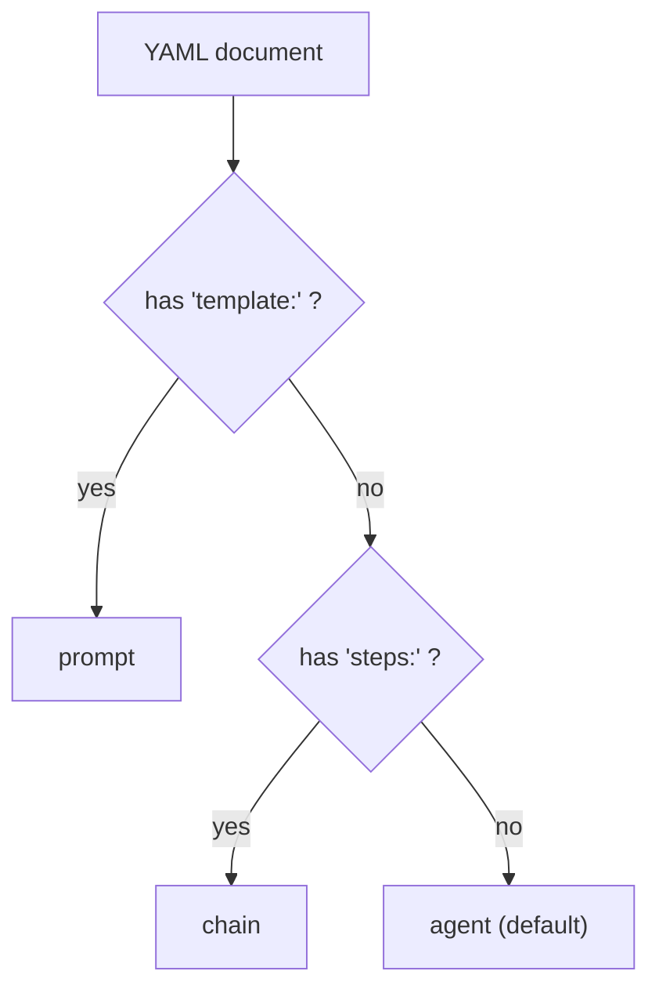

# Prompt, agent & chain YAML

Alongside the [graph DSL](/docs/dsl/graph-yaml-syntax), Adriane has a second DSL — `lang-adriane`
— for the three building blocks that sit *inside* a graph's nodes: **prompts**, **agents**, and
**chains**. All three are one YAML document each, and all three compile through the same
`parse → ast → validate → transform` pipeline (source:
`packages/lang-adriane/src/compiler/compile-file.ts`).

A single file is one kind. The kind is inferred, not declared — see [detectKind](#how-the-kind-is-detected).

## How the kind is detected

`detectKind` (`packages/lang-adriane/src/compiler/compile-file.ts`) decides which builder/validator
to run from the **shape of the document**, in this order:



- A top-level **`template:`** key → **prompt**.
- Otherwise a top-level **`steps:`** key → **chain**.
- Otherwise → **agent** (the default fallthrough).

So you never write a `kind:` field. Put a `template`, and it's a prompt; put `steps`, and it's a
chain; otherwise it's an agent.

## Prompt

A named, variable-aware template. Variables are referenced with `{{ name }}` tokens, declared in
a `variables` list, and an optional `truncate:<n>` filter is supported (e.g. `{{ body | truncate:200 }}`).

| Field | Type | Required | Notes |
| --- | --- | --- | --- |
| `name` | string | yes | Prompt name. Blank → `PROMPT_NAME_REQUIRED` error. |
| `template` | string | yes | The template body. Blank → `PROMPT_TEMPLATE_REQUIRED` error. |
| `variables` | string[] | no | Declared variable names. Undeclared `{{ … }}` tokens raise a warning. |

```yaml
name: support-reply
template: |
  You are a support agent. Answer the customer politely.

  Customer message: {{ message }}
  Account tier: {{ tier }}
variables:
  - message
  - tier
```

```bash
adriane validate ./support-reply.yaml
```

Expected result: no error diagnostics, exit code `0`. A `{{ token }}` not present in `variables`
compiles but emits an `UNDECLARED_TEMPLATE_VARIABLE` **warning** (severity `warning`, source
`packages/lang-adriane/src/transformer/template-engine.ts`).

:::note Rendering is a separate step
Compiling a prompt produces a `PromptTemplate` with a `render(variables)` function. Rendering an
unresolved variable substitutes `""` and emits an `UNRESOLVED_VARIABLE` warning — it does not
throw. The DSL compiler validates and prepares the template; it does not bind values.
:::

## Agent

A reusable agent definition: an id, a description, a **prompt reference** (by name/id, not an
inline template), and a list of tool names.

| Field | Type | Required | Notes |
| --- | --- | --- | --- |
| `id` | string | yes | Agent id. Blank → `AGENT_ID_REQUIRED` error. |
| `description` | string | no | Free-text description. |
| `prompt` | string | yes | A **reference** to a prompt (by name/id). Blank → `AGENT_PROMPT_REQUIRED` error. |
| `tools` | string[] | no | Tool names the agent may call (non-strings are dropped). |

```yaml
id: support-agent
description: Answers tier-1 support questions and escalates the rest.
prompt: support-reply        # references the prompt above, by name
tools:
  - search_knowledge_base
  - create_ticket
```

This file has neither `template:` nor `steps:`, so `detectKind` classifies it as an **agent**.

:::warning `prompt` is a reference, not a template
The agent's `prompt` field is a string **id/name**, resolved elsewhere — it is not an inline
prompt body. There is no `llm`, `tier`, `model`, or `provider` field in the agent DSL: the model
binding is supplied by the runtime/SDK, not the YAML. The DSL captures *which* prompt and *which*
tools, not *which model*.
:::

## Chain

A linear sequence of agent invocations. Each step names an `agentId` and an optional structured
`input` object.

| Field | Type | Required | Notes |
| --- | --- | --- | --- |
| `id` | string | yes | Chain id. Blank → `CHAIN_ID_REQUIRED` error. |
| `steps` | list | yes (≥ 1) | Empty/missing → `CHAIN_STEPS_REQUIRED` error. |
| `steps[].agentId` | string | yes | The agent to invoke. Blank → `CHAIN_STEP_AGENT_REQUIRED` error. |
| `steps[].input` | object | no | Structured input for that step (a plain map; arrays/scalars are ignored). |

```yaml
id: support-pipeline
steps:
  - agentId: classifier
    input:
      label: intent
  - agentId: support-agent
    input:
      escalate: false
```

The presence of `steps:` makes `detectKind` classify this as a **chain**.

```bash
adriane validate ./support-pipeline.yaml
```

Expected result: no error diagnostics, exit code `0`. A step with a blank `agentId` would yield a
`CHAIN_STEP_AGENT_REQUIRED` error and exit code `1`.

## Diagnostic shape and codes

Every validator returns the same `Diagnostic` shape as the graph DSL:

```ts
type Diagnostic = {
  code: string;
  message: string;
  loc: { line: number; col: number; file: string };
  severity: "error" | "warning";
};
```

| Code | Kind | Severity | Raised when |
| --- | --- | --- | --- |
| `PROMPT_NAME_REQUIRED` | prompt | error | `name` is blank. |
| `PROMPT_TEMPLATE_REQUIRED` | prompt | error | `template` is blank. |
| `UNDECLARED_TEMPLATE_VARIABLE` | prompt | warning | A `{{ … }}` token isn't in `variables`. |
| `UNRESOLVED_VARIABLE` | prompt | warning | A token has no value **at render time**. |
| `AGENT_ID_REQUIRED` | agent | error | `id` is blank. |
| `AGENT_PROMPT_REQUIRED` | agent | error | `prompt` reference is blank. |
| `CHAIN_ID_REQUIRED` | chain | error | `id` is blank. |
| `CHAIN_STEPS_REQUIRED` | chain | error | `steps` is empty or missing. |
| `CHAIN_STEP_AGENT_REQUIRED` | chain | error | A step's `agentId` is blank. |

Compilation stops and returns no `result` if any diagnostic is `error`-severity; `warning`s pass
through.

## Authoring from the CLI

Scaffold an agent file, then validate and compile it. The `adriane` CLI routes a file **without**
`.graph.` in its name through `lang-adriane`, which then applies `detectKind`.

```bash
adriane init agent --id support-agent --out ./support-agent.yaml
```

Expected result: writes the file and prints `Initialized agent template at ./support-agent.yaml`,
exit code `0`. (`init` requires both `--id` and `--out`; see the [CLI reference](/docs/cli/commands).)

```bash
adriane validate ./support-agent.yaml
adriane compile ./support-agent.yaml --out ./dist
```

Expected result: `validate` prints diagnostics and exits `0` when clean; `compile` writes
`./dist/support-agent.json` and prints `Wrote ./dist/support-agent.json`. On any `error`
diagnostic, `compile` writes nothing and exits `1`.

:::note Which compiler runs
`adriane` picks the DSL by file name: a name containing `.graph.` is compiled by `graph-adriane`;
anything else is compiled by `lang-adriane`, which then infers prompt / agent / chain via
`detectKind`. `run` and `diff` operate only on graph files.
:::

## Next

- [Graph YAML syntax](/docs/dsl/graph-yaml-syntax)
- [The compiler pipeline](/docs/dsl/compiler-pipeline)
- [CLI commands](/docs/cli/commands)
