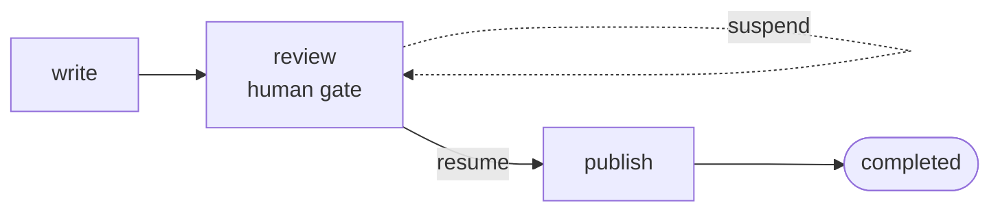

# Quickstart

Install, paste one graph, run it. A linear flow with a **human gate** that suspends cleanly and
resumes from the latest checkpoint — the smallest thing that shows what Adriane is for.

## Install

```bash
npm i @adriane-ai/graph-sdk     # TypeScript — pulls the Rust engine for you
# Python: pip install adriane-ai
```

## Run a governed graph

```ts
import { createGraph } from "@adriane-ai/graph-sdk";

const app = createGraph({ name: "publish-flow" })
  .channel("draft", { type: "string", default: "" })
  .channel("approved", { type: "boolean", default: false })
  .node("write", async () => ({ draft: "Hello from Adriane." }))
  .humanGate("review") // suspends the run; resume after a human approves
  .node("publish", async () => ({ approved: true }))
  .edge("write", "review")
  .edge("review", "publish")
  .compile();

const suspended = await app.run();                  // runs `write`, then stops at the gate
console.log(suspended.status);                      // "suspended"

const done = await app.resume(suspended.runId);     // a human approved out-of-band
console.log(done.status, done.channels.approved);   // "completed" true
```

## Expected result

```
suspended
completed true
```

The run executes `write`, **suspends** at `review` (the gate emits `run_suspended`), and on
`resume` continues from the latest checkpoint through `publish` to `completed` — no completed
work re-run.

:::note This snippet is tested
It is the shipped `examples/quickstart.ts`, exercised by the SDK test suite — if the API
changes, the test breaks, so what you paste stays honest.
:::

## What you just used



- A **human gate** that suspends the run instead of blocking a thread.
- A **checkpoint** taken after every node, which is what makes `resume` exact.

## Next — climb the ladder

You ran a graph that **suspends**. Two short rungs to the full picture:

1. ➡️ **[Add a real agent](/docs/getting-started/agent-quickstart)** — make a node *think*, in any model (~30 seconds).
2. **[Govern it](/docs/getting-started/governance-quickstart)** — gate a sensitive tool, approve it, get a signed, replayable attestation.

Then go wider: [Your first run](/docs/getting-started/your-first-run) (build from scratch) · [Why Adriane](/docs/introduction/why-adriane) (the thesis).
