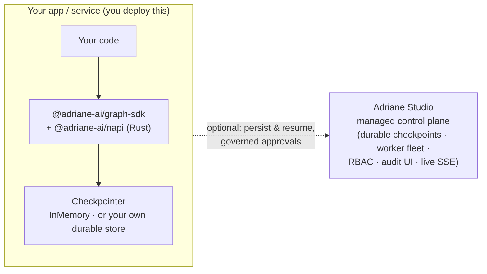

# Running in production

The Adriane engine is a **library**, not a server. `@adriane-ai/graph-sdk` (and the Python
`adriane-ai`) compiles and runs graphs **in-process**, inside your own Node or Python
application or service. There is **no engine server to deploy** — you deploy *your* app,
exactly as you would any other dependency. The Rust engine runs natively when the
`@adriane-ai/napi` addon ships alongside the SDK, with a TypeScript fallback when it is
absent (see [the execution contract](/docs/core-concepts/execution-contract)).

So "running Adriane in production" is really three decisions about your own app: which
`Checkpointer` you give it, how you scale it, and how you supply provider keys.

## Choosing a Checkpointer

A checkpoint is the full typed state plus the position in the graph, written after every
node completion. *Where* those checkpoints live is the one production decision the engine
forces on you, because it determines whether a suspended run can resume in a different
process.

The engine ships exactly two things here: the `Checkpointer` **interface** and an
`InMemoryCheckpointer`.

### `InMemoryCheckpointer` — ephemeral / single-process

The default. Checkpoints live in the process's memory. Perfect for tests, scripts, and
single-process apps where a run starts and finishes inside one process lifetime. The moment
the process exits, those checkpoints are gone — a run suspended on a human gate cannot be
resumed by any other process, including a fresh instance of the same app.

```ts
import { createGraph } from "@adriane-ai/graph-sdk";

const app = createGraph({ name: "publish-flow" })
  // …nodes…
  .compile(); // InMemoryCheckpointer by default
```

### Implement `Checkpointer` for durable, cross-process resume

For anything that suspends on a human gate, must survive a restart, or has to resume in a
*different* process from the one that started it, you need durable checkpoints. The engine
never assumes a particular backend — you **implement the `Checkpointer` interface** against
whatever store you already run (Postgres, Redis, a document store), and pass your instance
to `.checkpointer(...)`:

```ts
import { createGraph, type Checkpointer } from "@adriane-ai/graph-sdk";

// Your own implementation, backed by whatever store you run.
const myCheckpointer: Checkpointer = createMyCheckpointer({
  connectionString: process.env.DATABASE_URL
});

const app = createGraph({ name: "publish-flow" })
  .checkpointer(myCheckpointer)
  // …nodes…
  .compile();
```

Once checkpoints are durable, `app.resume(runId)` works across process boundaries: one
process suspends a run, a human approves hours later, and a fresh process resumes it from
the persisted checkpoint. See
[persistent checkpointing](/docs/core-concepts/resumability-and-approvals).

:::tip Don't want to build the durable layer?
Reach for **Adriane Studio** — the managed control plane gives you durable checkpointing, a
worker fleet, and the governance UI out of the box, so you embed the open engine in your app
and let Studio persist and resume runs for you. See the [Engine vs Adriane Studio](#engine-vs-adriane-studio)
boundary below.
:::

## Scaling your app horizontally

The engine holds **no global mutable state** of its own — all run state lives in the
`Checkpointer`. That makes your app trivially scalable: run as many instances as you like
behind your usual load balancer, and as long as they share a **durable** `Checkpointer`,
any instance can start, suspend, or resume any run. A run suspended on instance A at a human
gate resumes cleanly on instance B once the approval lands.

The only caveat is the one the contract already names: resume against the **same compiled
graph** that produced the checkpoint. A checkpoint encodes a position in a specific graph,
so every instance must build the same `CompiledGraph` (same nodes, edges, conditions).
Ship one graph definition across your fleet and you are done. With `InMemoryCheckpointer`,
by contrast, runs are pinned to the single process that created them — fine for ephemeral
workloads, unusable for a fleet.

## Provider keys via env

`OPENAI_API_KEY`, `ANTHROPIC_API_KEY`, and `MISTRAL_API_KEY` are read **only** by the LLM
gateway, and only from the process environment. Set them on your app's runtime the way you
set any other secret — never hardcode a key in a graph, a prompt, or source, and never check
one into the repo. Agents reference prompts by id/version and models by **tier**, so neither
your graph nor your prompts carry a secret. See
[best practices](/docs/production/best-practices#pin-tiers-not-hardcoded-models).

## The Rust addon ships with the SDK

The native Rust engine loads through the `@adriane-ai/napi` addon. When a prebuilt binary
for your platform ships with the SDK, runs execute on the Rust engine automatically; when it
is absent (musl/Alpine, Windows arm64, or any host with no prebuilt binary), `CompiledGraph`
falls back to the in-process TypeScript engine with an identical public API. Nothing in your
deployment changes either way — you `npm install` (or `pip install`) the SDK and the right
engine is selected at runtime. Verify which one you're on with `rustEngineAvailable()`; the
failure modes are covered in [troubleshooting](/docs/production/troubleshooting#rustengineavailable-is-false).

## Engine vs Adriane Studio

The open engine in this repo is a **library + SDK**. It enforces the runtime guarantees and
the governance primitives, but it does not run any services for you. When you want the managed
platform around it — durable storage, a worker fleet, RBAC, an audit UI — that is **Adriane
Studio**, a separate commercial product. The split mirrors the way Temporal separates its open
SDK from the Temporal Service/Cloud.

| | Open engine (this repo) | Adriane Studio (commercial) |
| --- | --- | --- |
| **What it is** | A library + SDK you embed in your app | A managed control plane you point your app at |
| **Packages** | `@adriane-ai/graph-sdk`, `@adriane-ai/cli`, Python `adriane-ai`, `@adriane-ai/napi`, graph-core/runtime, agents-core, llm-gateway | Hosted platform — not in this repo |
| **Checkpointing** | `Checkpointer` interface + `InMemoryCheckpointer` (you implement durable storage) | Durable Postgres checkpointing, managed |
| **Execution** | In-process, in your app | A managed **worker fleet** |
| **Governance** | No-self-approval guard (Rust), attestation, lifecycle events, the SDK approval API | RBAC, approvals bound to authenticated principals, the **audit UI** |
| **Live view** | `onEvent` + the event journal (you build any UI) | Live **SSE governance views** out of the box |
| **You run** | Your own app + your own store | Nothing — Studio is managed |

The engine alone is complete: it enforces no-self-approval, attests decisions, emits a
lifecycle event for every transition, and exposes the SDK approval API (`humanGate`,
`suspendForApproval`, `approveAndResume`, `onEvent`). A control plane — one you build on the
SDK, or **Adriane Studio** — adds the parts that need persistence and identity: binding
approvals to authenticated principals, storing the audit journal, and serving the live view.
Reach for Studio when you'd otherwise be rebuilding that platform yourself.



## Next

- [Production best practices](/docs/production/best-practices)
- [Troubleshooting](/docs/production/troubleshooting)
