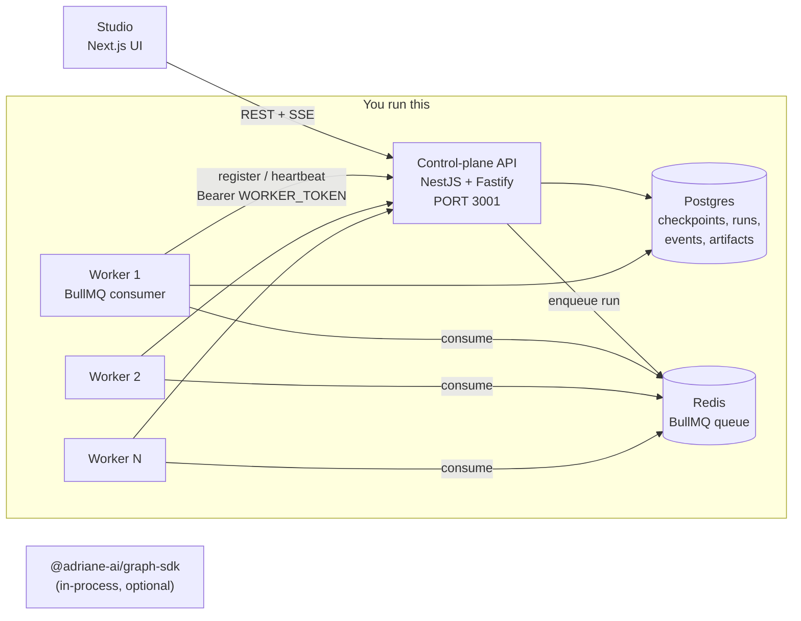

# Deployment

Adriane is **self-hosted**. There is no managed cloud: you run Postgres, Redis, the
control-plane API, and one or more workers yourself. The SDK (`@adriane-ai/graph-sdk`)
runs in-process and needs none of this — you only reach for the control plane when you
want persisted runs, the event journal, approval gates resolved by a human, and a
Studio UI over them.

:::note Early self-host story
This is a working self-host setup, not a turnkey product. There is no Helm chart, no
managed offering, and no zero-downtime migration tooling yet. Schema changes go through
Drizzle `db:push` (see below), which is a direct sync — fine for a single operator, not
a blue/green rollout. Treat what follows as the honest minimum to run the stack.
:::

## Architecture

Four pieces, with a one-directional dependency rule (engine ← control plane ← Studio):



- **SDK** (`@adriane-ai/graph-sdk`) — the framework-agnostic engine. Compile and run
  graphs entirely in-process; no API, no DB. The Rust engine runs natively when the
  `@adriane-ai/napi` addon is present, with a TypeScript fallback (see
  [the execution contract](/docs/core-concepts/execution-contract)).
- **Control-plane API** — NestJS on the Fastify adapter. REST + Swagger at `/docs`,
  plus an SSE stream per run. Thin controllers over services that drive the engine and
  persist to Postgres.
- **Worker** — a standalone BullMQ consumer that executes runs off the Redis queue,
  registers itself with the API, heartbeats, and drains on `SIGTERM`/`SIGINT`.
- **Studio** — the Next.js UI. Renders data from the API; never executes the runtime.

## What you self-host

Postgres, Redis, the API, and the worker fleet. Studio is optional (it is just a client
of the API). The SDK is a library, not a service.

## Environment variables

The API and worker both validate their environment through the same Zod schema in
`@adriane-ai/config` (`packages/config/src/env.ts`). Boot **fails closed** if the
schema does not pass.

| Var | Required | Default | Notes |
| --- | --- | --- | --- |
| `NODE_ENV` | yes | — | `local` \| `staging` \| `production`. Gates the fail-secure rules below. |
| `PORT` | no | `3000` | The API listens here. Run it on **3001** so it does not collide with Studio on 3000. |
| `DATABASE_URL` | yes | — | Postgres connection string. |
| `REDIS_URL` | yes | — | Redis connection string (BullMQ queue). |
| `JWT_SECRET` | yes | — | Signing secret for user auth tokens. |
| `JWT_EXPIRY` | no | `1h` | Token lifetime. |
| `AUTH_DISABLED` | no | `false` | Dev/offline escape hatch. **Refuses to boot** outside `NODE_ENV=local` (see below). |
| `WORKER_TOKEN` | conditional | — | Shared m2m secret for worker ↔ API. Optional in `local`, **required (non-empty) everywhere else**. |
| `OPENAI_API_KEY` | no | — | Provider key; only the LLM gateway reads it. |
| `ANTHROPIC_API_KEY` | no | — | Provider key. |
| `MISTRAL_API_KEY` | no | — | Provider key. |
| `OTEL_ENDPOINT` | no | — | OpenTelemetry collector endpoint. |
| `LOG_LEVEL` | no | `info` | `debug` \| `info` \| `warn` \| `error`. |

The worker also reads a few non-schema vars directly (`packages` aside, in
`apps/worker/src/main.ts`): `WORKER_CONCURRENCY` (default `5`), `WORKER_DRAIN_TIMEOUT_MS`
(default `30000`), and `API_BASE_URL` (defaults to `http://localhost:${PORT}`).

## Postgres + Redis

The dev stack uses Docker (`docker-compose.dev.yml`): `postgres:16` on `5432` and
`redis:7-alpine` on `6379` with append-only persistence.

```bash
docker compose -f docker-compose.dev.yml up -d
```

Expected result: a healthy `postgres` (Postgres 16, user/db `adriane`) and a `redis`
running `redis-server --appendonly yes`.

For staging/production, point `DATABASE_URL` and `REDIS_URL` at managed instances
instead — nothing in the API assumes the compose containers specifically.

## Sync the schema (Drizzle)

The schema is **not** migrated on boot. Push it before the API starts, or seeding is
skipped and `/graphs`/`/runs` come up empty.

```bash
pnpm --filter @adriane-ai/db db:push
```

Expected result: the tables (including `workers`, `runs`, `events`, checkpoints,
artifacts) exist. The API's seed step then inserts the example catalog graphs on
bootstrap.

:::warning Order matters
`db:push` must run **before** the API boots. The seed runs in
`onApplicationBootstrap`; if the tables are missing it logs `Skipped seeding: …` and
swallows the error, so the API comes up healthy but with no graphs. See
[troubleshooting](/docs/production/troubleshooting).
:::

## Run the API

```bash
PORT=3001 pnpm --filter @adriane-ai/api dev
```

Expected result: NestJS boots on `0.0.0.0:3001`, Swagger is at
`http://localhost:3001/docs`, and `GET /health` returns `{"status":"ok"}`. CORS is
enabled with `origin: true` **only** when `NODE_ENV=local`.

## Run a worker

The worker is a separate process. It waits for the API to be ready, registers itself,
then consumes runs off the Redis queue and heartbeats every 10 s.

```bash
pnpm --filter @adriane-ai/worker dev
```

Expected result: the worker waits for the API, `POST /workers` registers it
(`{ workerId, capacity, status: "active" }`), and a `PUT /workers/:id/heartbeat` fires
on a 10-second interval (`apps/worker/src/heartbeat.ts`). `capacity` is the configured
`WORKER_CONCURRENCY` (default 5).

:::note The worker is optional for synchronous runs
In the demo path the API executes a run synchronously and the worker is not needed. The
worker exists for off-loading run execution to a separate, horizontally-scalable
process pool over Redis.
:::

### Scaling horizontally

Start more worker processes. Each registers with its own `workerId` (a `nanoid`) and
pulls jobs off the **same** BullMQ queue in Redis — BullMQ distributes jobs across
consumers, so adding workers adds throughput with no coordination beyond the shared
Redis instance.

```bash
# three workers, eight concurrent jobs each
WORKER_CONCURRENCY=8 pnpm --filter @adriane-ai/worker dev   # ×3, in separate processes/hosts
```

Expected result: three rows in `GET /workers`, all heartbeating, all draining the one
queue.

On `SIGTERM`/`SIGINT` a worker flips its registration to `status: "draining"`, stops
taking new jobs, waits up to `WORKER_DRAIN_TIMEOUT_MS` for in-flight jobs to finish,
deregisters (`DELETE /workers/:id`), then exits 0 (`apps/worker/src/main.ts`,
`drain.ts`).

## Worker ↔ API auth (`WORKER_TOKEN`)

The fleet self-service routes (`POST /workers`, `PUT /workers/:id/heartbeat`,
`DELETE /workers/:id`) are machine-to-machine. The worker sends the shared
`WORKER_TOKEN` as `Authorization: Bearer <token>`; the API's `WorkerTokenGuard`
compares it in **constant time**.

- In `NODE_ENV=local` the token is optional — the worker omits the header and the
  routes are reachable because the API runs with `AUTH_DISABLED` (below).
- **Everywhere else** the env schema refuses to boot without a non-empty
  `WORKER_TOKEN`. Set the same value on the API and every worker.

## `AUTH_DISABLED` is local-only (fail-secure)

`AUTH_DISABLED=true` makes the global `JwtAuthGuard` inject a system principal instead
of rejecting unauthenticated requests — useful for local boot, the seed, offline
scripts, and the SSE live view (an `EventSource` cannot send an `Authorization`
header).

The env schema (`superRefine` in `env.ts`) **refuses to boot** if `AUTH_DISABLED` is
true and `NODE_ENV` is anything but `local`:

```
AUTH_DISABLED must not be enabled outside NODE_ENV=local
```

So a misconfigured staging/prod can never run unauthenticated, even if someone flips the
flag. The same fail-secure rule applies to `WORKER_TOKEN`.

## Next

- [Production best practices](/docs/production/best-practices)
- [Troubleshooting](/docs/production/troubleshooting)
