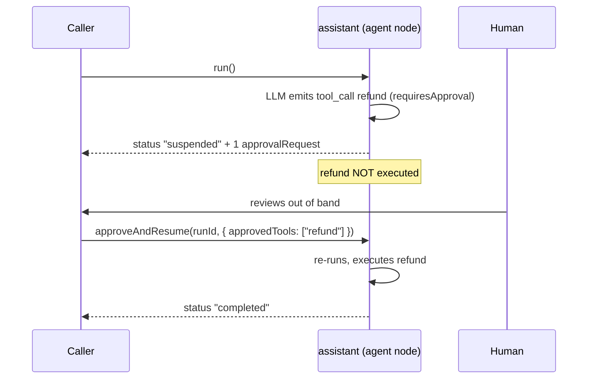

# Governed refund agent

This is the recipe Adriane exists for. A ReAct agent decides to call a **sensitive tool**
(`refund`). Because the tool is `requiresApproval: true`, the agent **cannot self-approve** —
the run suspends cleanly at the agent node. A human (a *different* principal) grants approval,
and `approveAndResume` re-runs the agent so the tool finally executes.

It runs offline on a scripted mock LLM — no API key, fully deterministic. The complete program
is the shipped example [`examples/agent.ts`](https://github.com/adriane-ai/adriane/blob/main/packages/graph-sdk/examples/agent.ts).



## The full program

```ts
import {
  createGraph,
  DefaultLLMGateway,
  InMemoryToolRegistry,
  MockLLMProviderAdapter,
  type LLMGateway,
  type ToolId
} from "@adriane-ai/graph-sdk";

// A mock LLM that always asks to call the `refund` tool (a structured tool call).
const mockLLM = (toolName: string): LLMGateway => {
  const gateway = new DefaultLLMGateway();
  gateway.registerAdapter(
    new MockLLMProviderAdapter({
      provider: "anthropic",
      response: {
        content: "",
        toolCalls: [{ id: "tu1", name: toolName, input: {} }],
        stopReason: "tool_use",
        usage: { promptTokens: 0, completionTokens: 0 },
        model: "mock",
        provider: "anthropic"
      }
    })
  );
  return gateway;
};

const refundHandler = async (): Promise<{ ok: boolean }> => {
  console.log("→ refund executed");
  return { ok: true };
};

const tools = new InMemoryToolRegistry();
tools.register(
  {
    id: "refund" as ToolId,
    name: "refund",
    description: "Issues a customer refund. Sensitive.",
    inputSchema: { parse: (v: unknown) => v },
    outputSchema: { parse: (v: unknown) => v },
    permissions: ["payments:write"],
    requiresApproval: true,
    jsonSchema: { type: "object" }
  },
  refundHandler
);

const app = createGraph({ name: "support-agent" })
  .agentNode("assistant", {
    llm: mockLLM("refund"),
    prompt: { system: "You are a support agent. Use tools when needed." },
    tools,
    suspendForApproval: true,
    maxIterations: 2
  })
  .compile();

// 1) The agent reaches for `refund` → run suspends for approval (tool not executed).
const suspended = await app.run();
console.log("status:", suspended.status);              // "suspended"
console.log("paused at:", suspended.currentNodeId);    // "assistant"
console.log("approval requests:", suspended.channels.agentResult?.approvalRequests.length); // 1

// 2) A human grants approval; the run resumes and the tool runs.
const done = await app.approveAndResume(suspended.runId, { approvedTools: ["refund"] });
console.log("resumed status:", done.status);           // "completed"
```

**Expected result:**

```text
status: suspended
paused at: assistant
approval requests: 1
→ refund executed
resumed status: completed
```

Note the ordering: `→ refund executed` prints **only after** `approveAndResume` — never during
the first `run()`. That is the guarantee. The sensitive side effect cannot happen until a human
has signed off.

## What makes it governed, line by line

- **`requiresApproval: true`** on the tool definition is the gate. A tool without it executes
  inline; a gated one suspends the run when the agent tries to call it.
- **`suspendForApproval: true`** on the `agentNode` tells the agent to suspend (not error) when
  it reaches a gated tool. The agent files an `approvalRequest` and parks.
- **`approveAndResume(runId, { approvedTools })`** grants the named tools and resumes. The agent
  re-runs and now executes the previously-gated tool.

The granting principal defaults to `"human"`. Pass `resolvedBy` to name the real approver:

```ts
await app.approveAndResume(suspended.runId, {
  approvedTools: ["refund"],
  resolvedBy: "ops-lead@acme.com"
});
```

:::warning No self-approval is enforced, not just convention
`resolvedBy` is recorded as each granted tool's resolver and carried to the Rust engine, which
**rejects the resume if `resolvedBy` is empty or equals the tool's requester** (the agent node).
On the TypeScript path, when the agent node is wired with an `ApprovalEngine`, the engine's own
`ensureCanResolve` enforces the same invariant. An agent can never approve its own output.
(Source: `packages/graph-sdk/src/compiled-graph.ts`, `ApproveAndResumeOptions`.)
:::

## Reading the suspension

The agent's `AgentResult` lands in the `agentResult` channel (the default output channel). When
the run suspends, `channels.agentResult.approvalRequests` lists what the agent wanted to do:

```ts
const reqs = suspended.channels.agentResult?.approvalRequests ?? [];
for (const r of reqs) {
  console.log(r); // the gated tool the agent asked to run
}
```

The `run` / `suspend` / `approveAndResume` API shown here is the open SDK — you call it from your
own service. A control plane on top — **Adriane Studio** (the managed governance platform), or one
you build on the SDK — surfaces these requests to a reviewer, binds the decision to an
authenticated principal, records it, and calls `approveAndResume` (or simply does not resume — a
rejection). For the durable, cross-process version of this loop — suspend in one process, approve
hours later, resume in another — see [resume across processes](./resume-across-processes).

## Run it

```bash
pnpm --filter @adriane-ai/graph-sdk example:agent
```

## Related

- [Approval gates](/docs/governance/approval-gates) — the gate mechanism in depth.
- [Tool approval and attestation](/docs/governance/tool-approval-and-attestation) — who approved, when, and what.
- [Agent nodes & ReAct](/docs/building/agent-nodes-and-react) — the `agentNode` config.
- [The execution contract](/docs/core-concepts/execution-contract) — why suspend/resume is exact.
