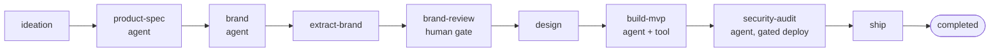

# Idea-to-ship pipeline

The capstone recipe: a single run that chains several agent nodes and exercises **both**
governance seams Adriane offers in one pipeline —

1. a **`humanGate`** (`brand-review`) — a structural pause in the graph, and
2. a **native agent suspension** — the security agent reaches for an approval-gated tool
   (`deploy_to_prod`) and the run suspends through a real `ApprovalEngine`; a human approves; the
   run resumes and deploys.

It runs offline on scripted mock LLMs and is self-verifying. The full program is the shipped
[`examples/startup-e2e.ts`](https://github.com/adriane-ai/adriane/blob/main/packages/graph-sdk/examples/startup-e2e.ts).



## The pipeline

Each agent node gets its own scripted gateway and its own output channel. Two tools: an ungated
scaffolder (`scaffold_mvp`) and a gated production deploy (`deploy_to_prod`, `requiresApproval:
true`). The security agent is wired with an `ApprovalEngine`, which routes its approval through a
human.

```ts
import {
  createGraph,
  DefaultLLMGateway,
  InMemoryToolRegistry,
  MockLLMProviderAdapter,
  type LLMGateway,
  type LLMResponse,
  type RunId,
  type ToolId
} from "@adriane-ai/graph-sdk";
import { InMemoryApprovalEngine } from "@adriane-ai/approval-engine";

// Scripted mock turns: a tool_use turn, then a FINAL: turn.
let toolUseSeq = 0;
const toolTurn = (name: string, input: Record<string, unknown> = {}): LLMResponse => ({
  content: "",
  toolCalls: [{ id: `tu_${(toolUseSeq += 1)}`, name, input }],
  stopReason: "tool_use",
  usage: { promptTokens: 0, completionTokens: 0 },
  model: "mock",
  provider: "anthropic"
});
const finalTurn = (content: string): LLMResponse => ({
  content,
  usage: { promptTokens: 0, completionTokens: 0 },
  model: "mock",
  provider: "anthropic"
});
const scripted = (responses: LLMResponse[]): LLMGateway => {
  const gateway = new DefaultLLMGateway();
  gateway.registerAdapter(new MockLLMProviderAdapter({ provider: "anthropic", responses }));
  return gateway;
};
const passthrough = { parse: (value: unknown) => value };

// Tools: an ungated scaffolder and a gated production deploy.
let scaffoldCount = 0;
const mvpTools = new InMemoryToolRegistry();
mvpTools.register(
  {
    id: "scaffold_mvp" as ToolId,
    name: "scaffold_mvp",
    description: "Scaffolds the MVP codebase from a template. Safe, reversible.",
    inputSchema: passthrough,
    outputSchema: passthrough,
    permissions: ["repo:write"],
    jsonSchema: { type: "object", properties: { template: { type: "string" } } }
  },
  async () => {
    scaffoldCount += 1;
    return { scaffolded: true, files: 12 };
  }
);

let deployCount = 0;
const securityTools = new InMemoryToolRegistry();
securityTools.register(
  {
    id: "deploy_to_prod" as ToolId,
    name: "deploy_to_prod",
    description: "Deploys to production. Sensitive — requires human approval.",
    inputSchema: passthrough,
    outputSchema: passthrough,
    permissions: ["prod:deploy"],
    requiresApproval: true,
    jsonSchema: { type: "object", properties: { target: { type: "string" } } }
  },
  async () => {
    deployCount += 1;
    return { deployed: true, url: "https://lumora.example.com" };
  }
);

// The approval engine: the human seam for the gated deploy.
const engine = new InMemoryApprovalEngine();

const app = createGraph({ name: "venture-pipeline" })
  .channel("idea", { type: "string", default: "" })
  .channel("brandName", { type: "string", default: "" })
  .channel("designSpec", { type: "string", default: "" })
  .channel("shipped", { type: "boolean", default: false })
  .node("ideation", async () => ({
    idea: "A governance-first control plane for fleets of AI agents."
  }))
  .agentNode("product-spec", {
    llm: scripted([finalTurn("FINAL: Positioning — the safety layer for agent operations.")]),
    prompt: { system: "You are a product strategist. Produce a crisp positioning statement." },
    maxIterations: 2,
    outputChannel: "specResult"
  })
  .agentNode("brand", {
    llm: scripted([finalTurn("FINAL: BRAND_NAME=Lumora — short, luminous, memorable.")]),
    prompt: { system: "You are a brand strategist. Propose one name as BRAND_NAME=<name>." },
    maxIterations: 2,
    outputChannel: "brandResult"
  })
  // Lift the proposed name out of the agent trace into a typed channel.
  .node("extract-brand", async (_input, state) => {
    const match = /BRAND_NAME=([A-Za-z0-9-]+)/.exec(state.channels.brandResult.reasoning);
    return { brandName: match?.[1] ?? "" };
  })
  // Governance seam #1: a human signs off on the brand before any build starts.
  .humanGate("brand-review")
  .node("design", async (_input, state) => ({
    designSpec: `Design system for ${state.channels.brandName}: deep indigo, generous whitespace.`
  }))
  .agentNode("build-mvp", {
    llm: scripted([
      toolTurn("scaffold_mvp", { template: "saas-starter" }),
      finalTurn("FINAL: MVP scaffolded — 12 files generated, ready for the security audit.")
    ]),
    prompt: { system: "You are a builder. Scaffold the MVP with your tools, then report." },
    tools: mvpTools,
    maxIterations: 4,
    outputChannel: "mvpResult"
  })
  // Governance seam #2: the deploy tool is approval-gated; the agent cannot
  // self-approve, so the run suspends through the ApprovalEngine.
  .agentNode("security-audit", {
    llm: scripted([
      // The scripted gateway is STATEFUL across suspend/resume: the gated tool_use is
      // scripted TWICE in a row (once before suspension, once on resume), then FINAL.
      toolTurn("deploy_to_prod", { target: "production" }),
      toolTurn("deploy_to_prod", { target: "production" }),
      finalTurn("FINAL: Security checks passed — deployed after human approval.")
    ]),
    prompt: { system: "You are a security auditor. Deploy only through the gated tool." },
    tools: securityTools,
    suspendForApproval: true,
    approvalEngine: engine,
    maxIterations: 4,
    outputChannel: "securityResult"
  })
  .node("ship", async () => ({ shipped: true }))
  .edge("ideation", "product-spec")
  .edge("product-spec", "brand")
  .edge("brand", "extract-brand")
  .edge("extract-brand", "brand-review")
  .edge("brand-review", "design")
  .edge("design", "build-mvp")
  .edge("build-mvp", "security-audit")
  .edge("security-audit", "ship")
  .compile();
```

:::warning Mock sequencing across suspend/resume
The scripted gateway is **stateful across suspend/resume**. When the security agent suspends on
the gated tool and is later resumed, it **re-runs** and consumes the *next* scripted response —
so the gated `tool_use` turn is scripted **twice in a row**, then the `FINAL:` turn. This is a
property of the deterministic mock, not the engine. (Source: the example's KEY comment in
`examples/startup-e2e.ts`.)
:::

## Run it act by act

Subscribe to the lifecycle journal, then drive the run through its three acts. The journal
pattern is the same one in the [dashboard recipe](./stream-to-dashboard).

```ts
const journal: string[] = [];
app.onEvent((event) => {
  const node = "nodeId" in event ? `:${String(event.nodeId)}` : "";
  journal.push(`${event.type}${node}`);
});

const RUN_ID = "run_startup_e2e_demo" as RunId;

// Act 1: run until the brand-review human gate.
const atBrandReview = await app.run({}, { runId: RUN_ID });
console.log(atBrandReview.status);              // "suspended"
console.log(atBrandReview.currentNodeId);       // "brand-review"
console.log(atBrandReview.channels.brandName);  // "Lumora" — extracted into its channel

// Act 2: the founder approves the brand; the build runs until the gated deploy.
const atSecurityGate = await app.resume(RUN_ID);
console.log(atSecurityGate.status);             // "suspended"
console.log(atSecurityGate.currentNodeId);      // "security-audit"
// scaffold_mvp ran (ungated); deploy_to_prod has NOT (gated, awaiting approval).

const pending = await engine.getPending(RUN_ID);
console.log(pending.length);                    // 1
console.log(pending[0]?.requestedBy);           // "security-audit"

// Act 3: a human (the founder) approves the deploy through the engine; the run ships.
await engine.approve(pending[0]!.id, "founder");
const shipped = await app.resume(RUN_ID);
console.log(shipped.status);                    // "completed"
console.log(shipped.channels.shipped);          // true
```

**Expected result:**

```text
suspended
brand-review
Lumora
suspended
security-audit
1
security-audit
completed
true
```

The journal records **exactly two** `run_suspended` entries (the brand gate, then the deploy
gate) and one `run_completed`. The ungated `scaffold_mvp` executes exactly once during Act 2; the
gated `deploy_to_prod` executes exactly once during Act 3 — **never before its approval**.

## The two governance seams, contrasted

| | `humanGate("brand-review")` | `security-audit` agent + `ApprovalEngine` |
| --- | --- | --- |
| What suspends | a structural node in the graph | the agent reaching a `requiresApproval` tool |
| How it resumes | `app.resume(runId)` | approve the engine request, then `app.resume(runId)` |
| Who decides | any out-of-band human signal | a principal that is **not** the requesting agent |
| Recorded as | a `run_suspended` event | an `ApprovalRequest` (`requestedBy = security-audit`) + event |

The whole pipeline above is the **open SDK** — you embed it in your own process and drive it with
`run` / `resume`. In production, *who* signs off at each seam and *where* the audit trail lives is
a control-plane concern: **Adriane Studio** (the managed governance platform) binds each approval
to an authenticated principal, persists the journal, and runs suspended pipelines on a worker
fleet — or you build the same on top of the SDK approval API. The engine enforces the invariant
either way (no self-approval, attestation, lifecycle events); the control plane decides and
records.

:::note Why this graph runs on the TypeScript engine
This example wires the `security-audit` agent with a TypeScript `approvalEngine`. The
engine-backed approval flow (file a request per gated tool, read the engine's decision on
resume) is a TypeScript-path feature, so a graph using it stays on the TS engine under the
default `"auto"` policy. The Rust engine remains the production runtime for everything else — for
the cross-process, Rust-backed governed resume, route approvals through `runCatalogGraph`'s
`approvalEngine` option instead (see [resume across processes](./resume-across-processes)).
(Source: `CompiledGraph.maybeCreateRustRunner`, `packages/graph-sdk/src/compiled-graph.ts`.)
:::

## Run it

```bash
pnpm --filter @adriane-ai/graph-sdk example:startup
```

## Related

- [Governed refund agent](./governed-refund-agent) — the single gated-tool loop in isolation.
- [Stream to a governance dashboard](./stream-to-dashboard) — the lifecycle journal as a live view.
- [Tool approval and attestation](/docs/governance/tool-approval-and-attestation) — who approved, when, and what.
- [Governance model](/docs/governance/governance-model) — the full request → approve → attest → resume policy.
