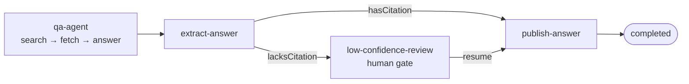

# RAG question answerer

The classic retrieval-QA flow: search a corpus, fetch the top document, answer with a citation.
The Adriane twist is the governance seam plain RAG stacks lack: a **conditional edge inspects
the answer** and routes anything *without* a citation marker into a `humanGate` instead of
publishing it. A grounded answer publishes straight through; an ungrounded one suspends until a
human resumes it.

It runs offline on a scripted mock LLM and is self-verifying — every claim is asserted, so the
process exits non-zero on the first failure. The full program is the shipped example
[`examples/qa-rag.ts`](https://github.com/adriane-ai/adriane/blob/main/packages/graph-sdk/examples/qa-rag.ts).



## The graph

The agent calls two tools (`search_documents`, `fetch_document`) over a small in-memory corpus,
then writes a `FINAL:` line. A pure node lifts that line into the typed `answer` channel, and two
conditional edges route on whether the answer carries a `[doc:<id>]` citation marker.

```ts
import {
  createGraph,
  DefaultLLMGateway,
  InMemoryToolRegistry,
  MockLLMProviderAdapter,
  type LLMGateway,
  type LLMResponse,
  type ToolId
} from "@adriane-ai/graph-sdk";

type Doc = { id: string; title: string; content: string };

const CORPUS: Doc[] = [
  {
    id: "checkpointing",
    title: "Checkpoints & resumability",
    content:
      "Adriane checkpoints a run after every node completion and state mutation. When a " +
      "process crashes or a run suspends for approval, you resume from the latest checkpoint."
  }
  // …more docs…
];

const tokenize = (text: string): string[] =>
  text.toLowerCase().split(/[^a-z0-9]+/).filter((t) => t.length > 2);

const scoreDoc = (doc: Doc, terms: string[]): number => {
  const haystack = `${doc.title} ${doc.content}`.toLowerCase();
  return terms.reduce((s, term) => s + (haystack.split(term).length - 1), 0);
};

// Scripted mock turns: a tool_use turn, then a FINAL: turn.
const toolTurn = (name: string, input: Record<string, unknown>): LLMResponse => ({
  content: "",
  toolCalls: [{ id: `tu_${name}`, name, input }],
  stopReason: "tool_use",
  usage: { promptTokens: 0, completionTokens: 0 },
  model: "mock",
  provider: "anthropic"
});
const finalTurn = (content: string): LLMResponse => ({
  content,
  usage: { promptTokens: 0, completionTokens: 0 },
  model: "mock",
  provider: "anthropic"
});
const scripted = (responses: LLMResponse[]): LLMGateway => {
  const gateway = new DefaultLLMGateway();
  gateway.registerAdapter(new MockLLMProviderAdapter({ provider: "anthropic", responses }));
  return gateway;
};

// An answer is "confident" when it carries a citation marker like [doc:checkpointing].
const CITATION = /\[doc:[a-z0-9-]+\]/;

const buildQaGraph = (script: LLMResponse[]) => {
  const passthrough = { parse: (value: unknown) => value };
  const tools = new InMemoryToolRegistry();

  tools.register(
    {
      id: "search_documents" as ToolId,
      name: "search_documents",
      description: "Keyword search over the corpus. Returns the top-3 documents with scores.",
      inputSchema: passthrough,
      outputSchema: passthrough,
      permissions: [],
      jsonSchema: { type: "object", properties: { query: { type: "string" } }, required: ["query"] }
    },
    async (input: unknown) => {
      const { query } = input as { query: string };
      const terms = tokenize(query);
      const hits = CORPUS.map((doc) => ({ id: doc.id, title: doc.title, score: scoreDoc(doc, terms) }))
        .sort((a, b) => b.score - a.score)
        .slice(0, 3);
      return { hits };
    }
  );
  tools.register(
    {
      id: "fetch_document" as ToolId,
      name: "fetch_document",
      description: "Returns the full content of a document by id.",
      inputSchema: passthrough,
      outputSchema: passthrough,
      permissions: [],
      jsonSchema: { type: "object", properties: { id: { type: "string" } }, required: ["id"] }
    },
    async (input: unknown) => {
      const { id } = input as { id: string };
      return CORPUS.find((doc) => doc.id === id) ?? { error: `document_not_found:${id}` };
    }
  );

  return createGraph({ name: "qa-over-docs" })
    .channel("question", { type: "string", default: "" })
    .channel("answer", { type: "string", default: "" })
    .channel("published", { type: "boolean", default: false })
    .agentNode("qa-agent", {
      llm: scripted(script),
      prompt: { system: "Answer using the document tools. Cite your source as [doc:<id>]." },
      tools,
      maxIterations: 5,
      outputChannel: "qaResult"
    })
    // Pull the agent's FINAL line out of its trace into the typed `answer` channel.
    .node("extract-answer", async (_input, state) => {
      const final = /^final:(.*)$/m.exec(state.channels.qaResult.reasoning);
      return { answer: (final?.[1] ?? "").trim() };
    })
    .humanGate("low-confidence-review")
    .node("publish-answer", async () => ({ published: true }))
    .edge("qa-agent", "extract-answer")
    // The governance twist: an uncited answer never publishes itself.
    .conditionalEdge("extract-answer", "publish-answer", "hasCitation", (s) =>
      CITATION.test(s.channels.answer)
    )
    .conditionalEdge("extract-answer", "low-confidence-review", "lacksCitation", (s) =>
      !CITATION.test(s.channels.answer)
    )
    .edge("low-confidence-review", "publish-answer")
    .compile();
};
```

## Path 1 — a cited answer publishes itself

Script the agent to search, fetch, and answer **with** a `[doc:...]` citation:

```ts
const QUESTION = "How does Adriane resume a run after a crash or an approval?";

const citedScript = [
  toolTurn("search_documents", { query: "resume run crash checkpoint approval" }),
  toolTurn("fetch_document", { id: "checkpointing" }),
  finalTurn(
    "FINAL: Adriane checkpoints after every node completion and state mutation, so a crashed " +
      "or suspended run resumes from the latest checkpoint [doc:checkpointing]."
  )
];

const cited = buildQaGraph(citedScript);
const citedRun = await cited.run({ question: QUESTION });

console.log(citedRun.status);             // "completed"
console.log(citedRun.channels.published); // true — auto-published, no human needed
```

**Expected result:** the cited run reaches `completed`, `channels.answer` contains
`[doc:checkpointing]`, and `channels.published` is `true`. It never touches the human gate.

## Path 2 — an uncited answer suspends for review

Same graph, a script where the agent fails to ground its answer:

```ts
const uncitedScript = [
  toolTurn("search_documents", { query: "resume run crash checkpoint approval" }),
  toolTurn("fetch_document", { id: "checkpointing" }),
  finalTurn("FINAL: It probably resumes from some saved state, but I could not ground this.")
];

const uncited = buildQaGraph(uncitedScript);
const suspended = await uncited.run({ question: QUESTION });

console.log(suspended.status);          // "suspended"
console.log(suspended.currentNodeId);   // "low-confidence-review"

// A human reviews the uncited answer out of band, then resumes.
const reviewed = await uncited.resume(suspended.runId);
console.log(reviewed.status);           // "completed"
console.log(reviewed.channels.published); // true — published on resume
```

**Expected result:** the uncited run **suspends** at `low-confidence-review` instead of
publishing. After a human resumes, it completes and publishes.

:::note This retriever is a keyword toy, on purpose
The corpus search above is term-frequency scoring (`scoreDoc`) with no embeddings, so the
example stays offline and deterministic. For real semantic retrieval, the SDK ships
`semanticRetriever` (real Mistral embeddings, with a deterministic fake embedder when no key is
set) and a composed retriever + reranker + agent pipeline — see the
[`doc-qa-reference.ts`](https://github.com/adriane-ai/adriane/blob/main/packages/graph-sdk/examples/doc-qa-reference.ts)
example and `prebuilt.ragAnswerer()`.
:::

## Run it

```bash
pnpm --filter @adriane-ai/graph-sdk example:qa
```

## Related

- [Agent nodes & ReAct](/docs/building/agent-nodes-and-react) — the agent node and prebuilt `ragAnswerer`.
- [Action nodes & routing](/docs/building/action-nodes-and-routing) — conditional edges and named conditions.
- [Components reference](/docs/building/components-reference) — `retriever`, `reranker`, `promptBuilder`.
