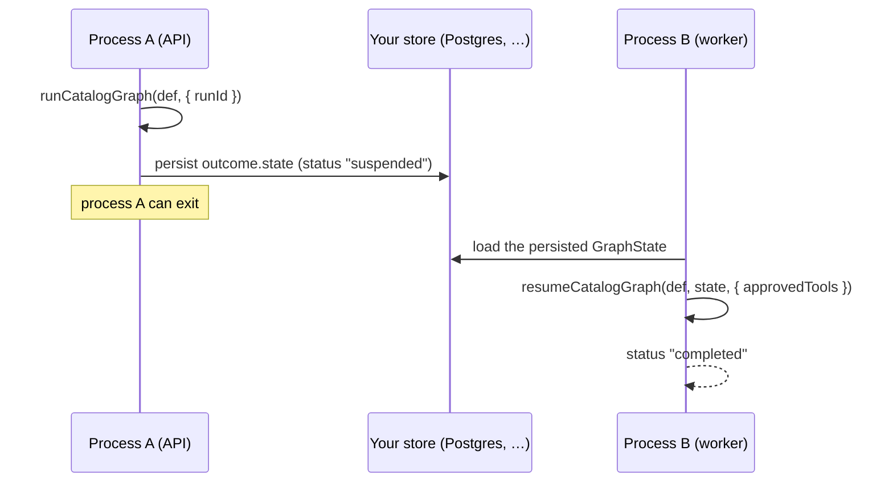

# Resume across processes

The realistic shape of a human-approval workflow: an API process starts a run, it **suspends**
for approval, the process exits, and hours later a *different* process (a worker) resumes it. To
cross that process boundary you need two things — a **stable run id** and a **persisted
checkpoint** — and a resume entry point that takes the checkpoint as data rather than reading it
from in-process memory.

That entry point is the **catalog run path**: `runCatalogGraph` and `resumeCatalogGraph`. They
run a plain `GraphDefinition` on the Rust engine and return a **serializable `GraphState`** you
can store anywhere and hand back later. This is the exact seam the Adriane control plane uses.



## Process A — start and persist

`runCatalogGraph(definition, options)` runs to completion or suspension and returns a
`CatalogRunOutcome`: `{ state, status, usedRustEngine }`. The `state` is a full `GraphState`
(channels included) you can `JSON.stringify` and persist.

```ts
import {
  runCatalogGraph,
  docQaReferenceDefinition, // any carrier-bearing GraphDefinition works
  type RunId
} from "@adriane-ai/graph-sdk";

const definition = docQaReferenceDefinition();
const RUN_ID = "run_refund_42" as RunId;

const outcome = await runCatalogGraph(definition, {
  runId: RUN_ID,
  initialData: { question: "…" }
});

console.log(outcome.status); // "suspended" when it parked for approval

if (outcome.status === "suspended") {
  // Persist the checkpoint anywhere durable — keyed by the stable run id.
  await myStore.put(RUN_ID, JSON.stringify(outcome.state));
}
// Process A can now exit. The checkpoint outlives it.
```

**Expected result:** `outcome.status` is `"suspended"` for a graph that hits a gate, and
`outcome.state` is a JSON-serializable snapshot you control the persistence of.

## Process B — load and resume

A fresh process loads the persisted state and calls `resumeCatalogGraph(definition, state, …)`.
The definition must be the *same* graph (it is data — store it, or rebuild it from the same
source). For a governed resume, pass the human-approved tools with their provenance.

```ts
import { resumeCatalogGraph, type GraphState, type RunId } from "@adriane-ai/graph-sdk";

const RUN_ID = "run_refund_42" as RunId;
const definition = docQaReferenceDefinition(); // the same graph, rebuilt or loaded
const state = JSON.parse(await myStore.get(RUN_ID)) as GraphState;

const resumed = await resumeCatalogGraph(definition, state, {
  // Each granted tool carries who requested it and who resolved it. The engine
  // re-validates the no-self-approval invariant per tool before unlocking it.
  approvedTools: [
    { name: "refund", requestedBy: "assistant", resolvedBy: "ops-lead@acme.com" }
  ]
});

console.log(resumed.status); // "completed"
```

**Expected result:** `resumed.status` is `"completed"`, and the gated tool executed exactly once
— in process B, after the approval, never in process A.

For an *ungoverned* resume (no gated tools to unlock), omit `approvedTools`:

```ts
const resumed = await resumeCatalogGraph(definition, state);
```

:::warning The Rust engine is required for cross-process resume
`runCatalogGraph` / `resumeCatalogGraph` throw `RustEngineUnavailableError` when the native
addon (`@adriane-ai/napi`) is absent — there is no TypeScript fallback for this seam. The Rust
engine re-validates the no-self-approval provenance on every resume (defence in depth on the
production path). (Source: `packages/graph-sdk/src/run-catalog-graph.ts`.)
:::

## Why not `CompiledGraph.resume()` across processes?

`CompiledGraph` (from `createGraph(...).compile()`) keeps its suspended state **in memory on the
instance**. On the Rust engine, `resume` / `approveAndResume` must follow the suspension on the
*same* `CompiledGraph` instance — resuming on a fresh instance throws *"No suspended state for
run …"*. That makes `CompiledGraph` the right tool for a **single-process** suspend/resume (the
[refund agent](./governed-refund-agent) and [RAG](./rag-question-answerer) recipes), but **not**
for crossing a process boundary. (Source: `CompiledGraph.requireSuspendedState`,
`packages/graph-sdk/src/compiled-graph.ts`.)

For the cross-process case, the catalog path is the supported seam because the checkpoint is
**returned to you as data** — you decide where it lives.

:::note Bring your own durable store
The catalog seam hands you a serializable `GraphState`; persisting it is yours to wire up
(Postgres, Redis, S3, a file). The Postgres-backed `Checkpointer` adapters used by the control
plane live in a private `@adriane-ai/db-adapters` package and are intentionally **not** in the
public SDK bundle, so the SDK never embeds the DB schema. The `Checkpointer` interface is
exported if you want to implement your own. (Source: the export comment in
`packages/graph-sdk/src/index.ts`.)
:::

## Approvals across the boundary

The two halves connect through an `ApprovalEngine`. When `runCatalogGraph` is given an
`approvalEngine`, the moment the run suspends it files one request per gated tool
(`requestedBy = nodeId`) and stashes the engine ids in the `__approvalIds` channel of the
returned state. A human resolves those requests out of band (the engine forbids self-approval),
and process B resumes with only the engine-approved tools.

```ts
const outcome = await runCatalogGraph(definition, {
  runId: RUN_ID,
  initialData: { question: "…" },
  approvalEngine: myEngine // requests filed on suspension; ids in __approvalIds
});
```

## Related

- [Governed refund agent](./governed-refund-agent) — the single-process version of the loop.
- [Resumability and approvals](/docs/core-concepts/resumability-and-approvals) — the contract that makes resume exact.
- [Governance model](/docs/governance/governance-model) — request → approve → attest → resume.
- [The napi bridge](/docs/architecture/napi-bridge) — how the catalog seam reaches the Rust engine.
