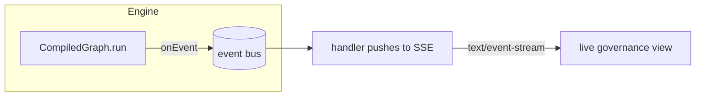

# Stream to a governance dashboard

Every node lifecycle transition emits a `RunEvent` — `node_started`, `node_completed`,
`node_failed`, `run_suspended`, `run_resumed`, `run_completed`, `run_failed`. Subscribing to
that stream with `onEvent` is the right surface for a live governance view: `run_suspended`
marks where a run paused for approval, `run_resumed` where it continued. The event journal **is**
the audit trail.

The journal pattern below is exactly what the shipped
[`examples/startup-e2e.ts`](https://github.com/adriane-ai/adriane/blob/main/packages/graph-sdk/examples/startup-e2e.ts)
asserts against.



## Capture the lifecycle journal

`onEvent(handler)` returns an unsubscribe function. Events flow from **either engine** through
the same bus, so subscribers see Rust and TypeScript runs identically.

```ts
import { type RunId } from "@adriane-ai/graph-sdk";

const journal: string[] = [];
const off = app.onEvent((event) => {
  const node = "nodeId" in event ? `:${String(event.nodeId)}` : "";
  journal.push(`${event.type}${node}`);
});

const result = await app.run({}, { runId: "run_demo" as RunId });
off();

console.log(result.status, journal);
```

**Expected result** for a graph that suspends at a gate, gets resumed, suspends again at a gated
tool, gets approved, and ships (the `startup-e2e` shape):

```text
completed [
  "node_started:ideation", "node_completed:ideation",
  …,
  "run_suspended:brand-review",
  "run_resumed:brand-review",
  …,
  "run_suspended:security-audit",
  "run_resumed:security-audit",
  "node_started:ship", "node_completed:ship",
  "run_completed"
]
```

You can assert on it directly — e.g. *"exactly two suspensions"* — which is what the example
does:

```ts
const suspensions = journal.filter((e) => e.startsWith("run_suspended")).length;
console.log(suspensions); // 2
console.log(journal.includes("run_completed")); // true
```

:::note Subscription is synchronous, fire-and-forget
`onEvent` handlers run synchronously as events are emitted, so keep them cheap — push to a queue
or a buffer; don't `await` a network call inside the handler. (Source:
`CompiledGraph.onEvent` → `eventBus.subscribe`, `packages/graph-sdk/src/compiled-graph.ts`.)
:::

## Relay over Server-Sent Events

To feed a browser dashboard, attach an `onEvent` subscriber that writes each event to an SSE
response, and unsubscribe when the run ends. This is framework-agnostic; the shape below works
with any Node HTTP handler.

```ts
import { type RunId } from "@adriane-ai/graph-sdk";

// Inside an HTTP handler that owns the response stream `res`:
function streamRun(app: CompiledGraph, runId: RunId, res: ServerResponse) {
  res.writeHead(200, {
    "Content-Type": "text/event-stream",
    "Cache-Control": "no-cache",
    Connection: "keep-alive"
  });

  const send = (event: unknown) => res.write(`data: ${JSON.stringify(event)}\n\n`);

  const off = app.onEvent((event) => {
    send(event);
    // Close the SSE stream on a terminal lifecycle event.
    if (
      event.type === "run_completed" ||
      event.type === "run_failed" ||
      event.type === "run_suspended"
    ) {
      off();
      res.end();
    }
  });

  // Kick off the run; events stream as it executes.
  void app.run({}, { runId });
}
```

The browser consumes it with `EventSource`:

```ts
const es = new EventSource(`/runs/${runId}/events`);
es.onmessage = (m) => {
  const event = JSON.parse(m.data);
  // Render the timeline: node_started → node_completed → run_suspended → …
  appendToTimeline(event.type, event.nodeId);
  if (event.type === "run_suspended") showApprovalPanel(runId); // a gate was hit
};
```

On `run_suspended`, the dashboard knows a gate was reached and can render the approval panel.
Approving out of band, then calling `resume` / `approveAndResume`, produces a fresh `run_resumed`
event the next stream picks up — see the [refund agent](./governed-refund-agent) recipe.

## `stream()` vs `onEvent()`

`onEvent` gives you the **lifecycle** journal (the right thing for a governance view). The
separate `stream(initialData, mode)` API gives you **state deltas** as an async iterable —
`"values"`, `"updates"`, `"messages"`, or `"debug"`:

```ts
for await (const event of app.stream({}, "updates")) {
  if (event.type === "state_update") console.log(event.nodeId, event.delta);
}
```

:::warning Rust has no incremental stream surface yet
On the **Rust engine** (the production path), `stream()` drives a *full* run and yields a
**single terminal** `state_value`; only the TypeScript engine streams per-`mode` granularity.
`onEvent` lifecycle events, however, fire from **both** engines identically. For a live dashboard
prefer `onEvent`; for fine-grained `stream` deltas in development, set `ADRIANE_SDK_ENGINE=ts`.
(Source: `CompiledGraph.stream` / `streamViaRust`, `packages/graph-sdk/src/compiled-graph.ts`,
and [streaming and events](/docs/building/streaming-and-events).)
:::

## Run it

The journal pattern is exercised end-to-end by:

```bash
pnpm --filter @adriane-ai/graph-sdk example:startup
```

## Related

- [Streaming and events](/docs/building/streaming-and-events) — every stream surface and event shape.
- [Observable runs](/docs/governance/observable-runs) — the audit/observability layer that records the same vocabulary.
- [The execution contract](/docs/core-concepts/execution-contract) — "if there is no event, it did not happen".
