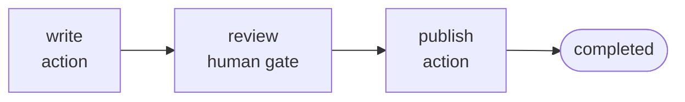

# YAML and the builder

Adriane graphs can be authored two ways, and both compile to the **same `GraphDefinition`** wire
format that feeds the same engine:

- **DSL YAML** — hand-written or tool-edited files. The graph *structure* is the artifact you
  store and review.
- **The SDK builder** (`createGraph`) — TypeScript code with real, typed handler closures
  attached to nodes.

This recipe authors one governed graph — write → human gate → publish — both ways.



## The builder version

The builder gives you typed channels and real handler code, and `compile()` returns a runnable
`CompiledGraph`. This is the shipped
[`examples/quickstart.ts`](https://github.com/adriane-ai/adriane/blob/main/packages/graph-sdk/examples/quickstart.ts).

```ts
import { createGraph } from "@adriane-ai/graph-sdk";

const app = createGraph({ name: "publish-flow" })
  .channel("draft", { type: "string", default: "" })
  .channel("approved", { type: "boolean", default: false })
  .node("write", async () => ({ draft: "Hello from Adriane." }))
  .humanGate("review") // suspends the run cleanly; resume it after approval
  .node("publish", async () => ({ approved: true }))
  .edge("write", "review")
  .edge("review", "publish")
  .compile();

// 1) Start the run — it suspends at the human gate.
const suspended = await app.run();
console.log(suspended.status); // "suspended"

// 2) A human approves out of band, then you resume from the latest checkpoint.
const done = await app.resume(suspended.runId);
console.log(done.status);        // "completed"
console.log(done.channels.approved); // true — channels are statically typed through to the result
```

**Expected result:**

```text
suspended
completed
true
```

The builder path is right when you need **real handler logic** — closures, agent nodes, tools —
and end-to-end channel typing (`done.channels.approved` is statically `boolean` here).

## The DSL (YAML) version

The same graph as a YAML document. A graph document mirrors the `GraphDefinition` fields:
`id`, `version`, `name`, `entryNodeId`, `channels`, `nodes`, `edges`. Node types are declared
structurally (`action`, `agent`, `tool`, `human-gate`, `subgraph`).

```yaml
id: publish-flow
version: 1.0.0
name: Publish flow
entryNodeId: write
channels:
  draft:
    type: string
    reducer: replace
  approved:
    type: boolean
    reducer: replace
nodes:
  - id: write
    type: action
    label: Write
  - id: review
    type: human-gate
    label: Review
  - id: publish
    type: action
    label: Publish
edges:
  - from: write
    to: review
    type: default
  - from: review
    to: publish
    type: default
```

The shipped way to compile graph DSL YAML is the **Python SDK's `compile_graph_yaml`** (it runs
the Rust compiler). It returns the compiled `GraphDefinition` as a dict and raises
`GraphCompileError` on failure.

```python
import adriane_ai

definition = adriane_ai.compile_graph_yaml(open("publish-flow.yaml").read())
print(definition["id"])          # "publish-flow"
print(definition["entryNodeId"]) # "write"
print(len(definition["nodes"]))  # 3
```

**Expected result:** a `GraphDefinition` dict whose `id`, `entryNodeId`, and node/edge structure
match the YAML above.

Validate a definition without running it — the fast feedback loop for hand-authored graphs:

```python
import adriane_ai

errors = adriane_ai.validate_graph({
    "id": "publish-flow", "version": "1.0.0", "name": "Publish flow",
    "entryNodeId": "write",
    "channels": {"draft": {"type": "string", "reducer": "replace"}},
    "nodes": [{"id": "write", "type": "action", "label": "Write"}],
    "edges": [],
})
print(errors)  # [] when valid; otherwise error dicts pinpointing the bad reference
```

## The same definition, two front doors

| | DSL (YAML) | SDK builder (`createGraph`) |
| --- | --- | --- |
| Authoring | hand-written / tool-edited files | TypeScript code, fully typed |
| Handlers | declared structurally (node types) | real closures attached to nodes |
| Output | a `GraphDefinition` (data) | a runnable `CompiledGraph` (data + handlers) |
| Best for | persisting/sharing graph **structure** | running graphs with custom node logic |

The builder produces the same `GraphDefinition` under the hood: a builder-authored graph and a
DSL-authored graph are validated and executed by the same engine. The Studio editor relies on
exactly this — it imports the graph compiler to compile/preview YAML client-side, then runs the
resulting definition on the engine through the [catalog path](./resume-across-processes).

:::note YAML declares structure, not handler code
DSL nodes carry a *type* (`action`, `agent`, …) and a label, not a function body. A
DSL-authored `action` node is a structural placeholder; the runnable behaviour is supplied by
the engine's node handlers (or, for agent/tool/component nodes, by the carrier metadata the Rust
engine resolves). Reach for the DSL when the **shape** of the graph is the artifact you want to
store and review; reach for the builder when you need real handler closures.
(Source: [the Adriane DSL](/docs/dsl/graph-yaml-syntax).)
:::

:::note Two DSL compilers
Adriane has a second DSL compiler for prompt/agent/chain YAML (the `lang-adriane` pipeline)
alongside this graph compiler (`graph-adriane`). The public, shipped entry point today is
**graph YAML** via `compile_graph_yaml`. Both run the same
`parse → ast → validate → transform → compile` pipeline.
:::

## Run it

The builder version is the default quickstart example:

```bash
pnpm --filter @adriane-ai/graph-sdk example
```

## Related

- [The Adriane DSL](/docs/dsl/graph-yaml-syntax) — the full graph-YAML shape.
- [The compiler pipeline](/docs/dsl/compiler-pipeline) — `parse → ast → validate → transform → compile`.
- [CLI authoring](/docs/cli/commands) — the `adriane` CLI (`@adriane-ai/cli`).
- [Graphs, nodes, edges, state](/docs/core-concepts/graphs-nodes-edges-state) — what a `GraphDefinition` is.
