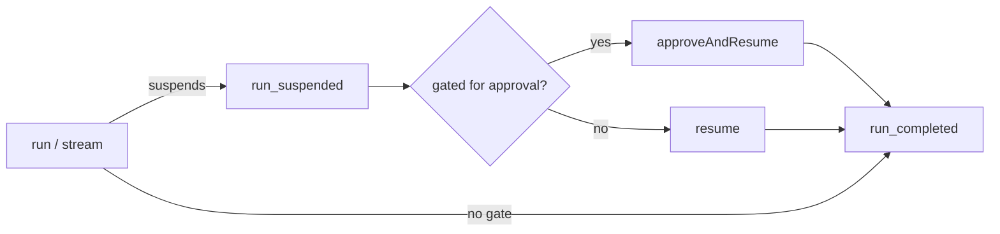

# Builder API

The fluent surface of `@adriane-ai/graph-sdk`. You build a graph with `createGraph(...)`,
chain `GraphBuilder` methods to declare channels, nodes and edges, then `compile()` into a
runnable `CompiledGraph`.

```ts
import { createGraph } from "@adriane-ai/graph-sdk";

const app = createGraph({ name: "greeter" })
  .node("hello", async (_input, state) => ({ greeting: `Hello, ${state.channels.name}!` }))
  .compile();

const result = await app.run({ name: "Ada" });
console.log(result.channels.greeting);
```

Expected result: prints `Hello, Ada!`.

The `TState` type parameter accumulates the declared channels as you call `.channel(...)`,
so handler state and the result of `run` / `resume` are fully typed without any manual
annotation. The whole API is in `packages/graph-sdk/src/builder.ts` and
`packages/graph-sdk/src/compiled-graph.ts`.

## `createGraph(options)`

```ts
const createGraph = (options: CreateGraphOptions): GraphBuilder<EmptyChannels>;
```

| Option | Type | Default | Meaning |
| --- | --- | --- | --- |
| `name` | `string` | — (required) | Human-readable graph name. |
| `id` | `string` | slugified `name` | Stable graph id. |
| `version` | `string` | `"0.0.0"` | Semver-ish version string. |
| `recursionLimit` | `number` | engine default | Bounds cyclic execution (see [execution contract](/docs/core-concepts/execution-contract)). |
| `metadata` | `Record<string, unknown>` | `undefined` | Arbitrary graph metadata. |

## GraphBuilder methods

Every method except `compile` / `safeCompile` returns the builder for chaining. The
channel-declaring and node-adding methods widen `TState`; `edge` / `conditionalEdge` /
`entry` return `this`.

### `channel(name, definition)`

```ts
channel<TName extends string, TValue = unknown>(
  name: TName,
  definition: ChannelInput<TValue>
): GraphBuilder<TState & { [K in TName]: TValue }>;
```

Declare one state channel. The value type is inferred from `definition.default`.

| Field | Type | Default | Meaning |
| --- | --- | --- | --- |
| `type` | `string` | — (required) | Channel type tag (e.g. `"string"`, `"json"`). |
| `reducer` | `ChannelReducer` | `"replace"` | How concurrent writes merge. See [channels and reducers](/docs/core-concepts/channels-and-reducers). |
| `default` | `TValue` | `undefined` | Initial value; also fixes the inferred type. |

### `messagesChannel(name?)`

```ts
messagesChannel<TName extends string = "messages">(
  name?: TName
): GraphBuilder<TState & { [K in TName]: Message[] }>;
```

Declare an append-reduced `Message[]` channel (the conversational default). Equivalent to
`channel(name, { type: "messages", reducer: "append", default: [] })`. `name` defaults to
`"messages"`.

### `node(id, handlerOrConfig)`

```ts
node(id: string, handlerOrConfig: TypedNodeHandler<TState> | NodeInput<TState>): this;
```

Add a node. Pass a bare handler for the common action case, or a config object. The first
node added becomes the entry node unless you call `entry(...)`.

| `NodeInput` field | Type | Default | Meaning |
| --- | --- | --- | --- |
| `type` | `NodeType` | `"action"` | Node type. |
| `handler` | `TypedNodeHandler<TState>` | — | Required for an `action` node — omitting it throws `MissingHandlerError`. |
| `label` | `string` | `id` | Display label. |
| `retryPolicy` | `RetryPolicy` | `undefined` | Per-node retry behaviour. |
| `metadata` | `Record<string, unknown>` | `undefined` | Arbitrary node metadata. |

Adding two nodes under the same id throws `DuplicateNodeError`.

A handler returns a channel-update object. It may also return a routing `Command`
(`{ goto, update? }`) — but see the [Rust caveat](#rust-engine-caveats) below: a `goto` is
dropped on the Rust path.

### `humanGate(id, options?)`

```ts
humanGate(id: string, options?: { label?: string }): this;
```

Add a **human-gate node**: a structural pause point where the run suspends for a human, separate
from agent-native tool approval. Full loop in [approval gates](/docs/governance/approval-gates).

### `agentNode(id, config)`

```ts
agentNode<TOut extends string = "agentResult">(
  id: string,
  config: AgentNodeConfig & { outputChannel?: TOut }
): GraphBuilder<TState & { [K in TOut]: AgentResult }>;
```

Add a ReAct agent node. Its `AgentResult` lands in `config.outputChannel` (default
`"agentResult"`), which is auto-declared and added to the typed state. Full walkthrough in
[agent nodes & ReAct](/docs/building/agent-nodes-and-react).

| `AgentNodeConfig` field | Type | Default | Meaning |
| --- | --- | --- | --- |
| `llm` | `LLMGateway` | — (required) | The gateway the agent runs on (TS path only — see caveats). |
| `prompt` | `AgentPromptSource` | — (required) | `{ system }` inline, or `{ registry, id, version? }`. |
| `tools` | `ToolRegistry` | `undefined` | Tools the agent may call. |
| `provider` | `LLMProvider` | `"anthropic"` | Pin the provider. |
| `model` | `string` | `undefined` | Pin the model (always wins over `tier`). |
| `tier` | `ModelTier` | `undefined` | Capability tier: `"frontier" \| "balanced" \| "fast" \| "creative"`. |
| `maxIterations` | `number` | agent default | Cap on the ReAct loop. |
| `name` | `string` | `id` | Agent name; also the approval requester principal. |
| `description` | `string` | `agent node <id>` | Agent description. |
| `outputChannel` | `string` | `"agentResult"` | Channel the result lands in. |
| `profile` | `AgentProfile` | `undefined` | `"fast" \| "frontier-careful" \| "governed-deep"` — a tier + efficiency-middleware + suspend/fs bundle. Explicit fields override it. See [middleware & profiles](/docs/advanced-agents/middleware-and-profiles#profiles). |
| `middleware` | `EfficiencyMiddlewareSpec[]` | `undefined` | Extra efficiency middleware (`compress` / `terse` / `contextBudget` / `reflection`). Governance kinds are rejected ([`GovernanceMiddlewareRejectedError`](/docs/reference/errors)). |
| `outputStyle` | `"terse"` | `undefined` | Token-efficiency: append a compact-output directive to the system prompt (desugars to a `terse` middleware). |
| `contextBudget` | `number` | `undefined` | Cap (chars) on the injected seed message (desugars to a `contextBudget` middleware). |
| `enableFs` | `boolean` | `false` | Opt into the [governed virtual filesystem](/docs/advanced-agents/governed-filesystem) tools (bound by the graph's `fsPolicy`). |
| `todosChannel` | `string` | `undefined` | Durable channel the agent's `writeTodos` list is persisted into. See [deep agents](/docs/advanced-agents/deep-agents). |
| `suspendForApproval` | `boolean` | `false` | Suspend the run when a gated tool is reached. |
| `approvalEngine` | `ApprovalEngine` | `undefined` | Route approvals through an engine (TS-engine only — see caveats). |
| `label` | `string` | `id` | Display label. |

Declaring `agentNode` also auto-declares the `__approvedTools` and `__approvalIds` channels
the governance path uses on resume.

### `toolNode(id, config)`

```ts
toolNode(id: string, config: ToolNodeConfig): GraphBuilder<TState & { messages: Message[] }>;
```

Add a tool node: it executes the tool calls emitted by the last AI message in the `messages`
channel (auto-declared as an append-reduced messages channel).

| `ToolNodeConfig` field | Type | Default | Meaning |
| --- | --- | --- | --- |
| `tools` | `ToolRegistry` | — (required) | The tools to execute. |
| `parallel` | `boolean` | `false` | Run all tool calls concurrently instead of sequentially. |
| `label` | `string` | `id` | Display label. |

:::warning Approval-gated tool node on Rust
A tool node whose tool is `requiresApproval` **suspends** the run on the TS engine, but on the
Rust engine its handler throws a `DynamicInterrupt` that surfaces as a *node failure*, not a
clean suspension. Route such a graph with `ADRIANE_SDK_ENGINE=ts` if you need it. (Source:
`compiled-graph.ts`.)
:::

### `taskNode(id, config)`

```ts
taskNode(id: string, config: TaskNodeConfig): GraphBuilder<TState & { [K: string]: AgentResult }>;
```

Spawn a sub-agent in an isolated context that returns one compressed report — sugar over a
one-node subgraph (checkpointed, audited, suspension-propagating). Full walkthrough in
[deep agents](/docs/advanced-agents/deep-agents).

| `TaskNodeConfig` field | Type | Default | Meaning |
| --- | --- | --- | --- |
| `subAgent` | `AgentNodeConfig` | — (required) | The sub-agent to spawn. |
| `objectiveChannel` | `string` | `"objective"` | The only channel projected into the child. |
| `reportChannel` | `string` | `"report"` | The only channel the child's report lands in. |
| `compress` | `boolean` | `true` | Run the sub-agent terse (a summary, not a full transcript). |

### `mapAgents(id, config)`

```ts
mapAgents<TJoin extends string>(
  id: string,
  config: MapAgentNodeConfig & { joinAt: TJoin }
): GraphBuilder<TState & { [K in TJoin]: AgentResult[] }>;
```

Add a **dynamic fan-out**: run `config.subAgent` once per item in the `config.overChannel` array,
**concurrently**, and write the per-item results — in **input order** (deterministic, resumable) —
into `config.joinAt` as an `AgentResult[]`. Unlike [`fanOut`](#fanoutfrom-parallelto-joinat) (a
fixed node list) or [`taskNode`](#tasknodeid-config) (one isolated sub-agent), `mapAgents` spawns a
runtime-sized N, each sharing the run's channels with one item as its `input`. Full walkthrough in
[deep agents](/docs/advanced-agents/deep-agents#mapagents--dynamic-fan-out).

| `MapAgentNodeConfig` field | Type | Default | Meaning |
| --- | --- | --- | --- |
| `overChannel` | `string` | — (required) | Channel holding the array of items to map over (auto-declared `json`, default `[]`). |
| `subAgent` | `AgentNodeConfig` | — (required) | The sub-agent to run per item. |
| `joinAt` | `string` | — (required) | Channel the per-item results land in, in input order (auto-declared `json`). |
| `suspendForApproval` | `boolean` | `false` | A gated spawn suspends the whole map; resume re-runs it. |
| `label` | `string` | `id` | Display label. |

:::note Rust engine only
`mapAgents` registers no TypeScript-fallback handler — it is a native Rust node. A graph using it
needs the native addon (it is not backed by the TS dev/test path). Each spawn gets `items[i]` as
its `input`; an absent or non-array `overChannel` yields an empty array and no spawns.
:::

### `subgraph(id, child, options?)`

```ts
subgraph<TChild>(
  id: string,
  child: GraphBuilder<TChild>,
  options?: { inputMapping?: Record<string, string>; outputMapping?: Record<string, string>; label?: string }
): this;
```

Embed another graph as a single node. The child shares the parent's registries, so a child node id
that collides with a parent id throws `DuplicateNodeError`. `inputMapping` / `outputMapping` project
channels in and out. A child that suspends suspends the whole run. Full walkthrough in
[subgraphs](/docs/building/subgraphs).

### `fsPolicy(rules)`

```ts
fsPolicy(rules: FsPolicyRule[]): this;
```

Set the run's filesystem path policy — the per-path permission rules every `enableFs` agent in the
graph is bound by. Each rule is `{ glob, verb }` with `verb` one of `"deny" | "read" | "gate" |
"write"`. **Fail-closed**: an unmatched path is read-only. Full reference in the
[governed virtual filesystem](/docs/advanced-agents/governed-filesystem#the-path-policy).

```ts
createGraph({ name: "researcher" })
  .fsPolicy([{ glob: "notes/**", verb: "write" }, { glob: "secret/**", verb: "deny" }])
  .agentNode("worker", { llm, prompt: { system: "…" }, enableFs: true })
  .compile();
```

### `component(id, descriptor, options?)`

```ts
component(id: string, descriptor: ComponentDescriptor, options?: { label?: string }): this;
```

Add a **pure (no-LLM) compute node** from the [component catalog](/docs/reference/component-catalog).
The node carries the `{ kind, params }` carrier so it runs natively on the Rust engine, and
registers the descriptor's equivalent TS handler for the TS fallback path.

```ts
import { createGraph, components } from "@adriane-ai/graph-sdk";

createGraph({ name: "p" })
  .channel("name", { type: "string", default: "" })
  .channel("prompt", { type: "string", default: "" })
  .component("build", components.promptBuilder({ template: "Hi {{name}}", into: "prompt" }))
  .compile();
```

Expected result: a graph with one component node `build` that renders `Hi <name>` into the
`prompt` channel.

:::note Integration components are not `component(...)` nodes
`components.httpFetch` and `components.webSearch` return a plain `NodeHandler`, not a
`ComponentDescriptor`. Add them with `node(...)`, not `component(...)`. See the
[catalog](/docs/reference/component-catalog#integration-components-vendor-io).
:::

### `edge(from, to)`

```ts
edge(from: string, to: string): this;
```

Add an unconditional edge.

### `conditionalEdge(from, to, conditionName, predicate)`

```ts
conditionalEdge(
  from: string,
  to: string,
  conditionName: string,
  predicate: TypedCondition<TState>
): this;
```

Add a conditional edge guarded by a **named predicate**. The predicate is registered under
`conditionName` and evaluated against the live, typed state — Adriane never `eval`s a
user-supplied string, which is what keeps routing safe and inspectable (see the
[execution contract](/docs/core-concepts/execution-contract)).

```ts
.conditionalEdge("assistant", "review", "needsReview", (s) => s.channels.agentResult.requiresHumanReview)
```

### `fanOut(from, parallelTo, joinAt)`

```ts
fanOut(from: string, parallelTo: string[], joinAt: string): this;
```

Mark `from` as a **scatter** point: the listed `parallelTo` nodes run concurrently, then converge
at `joinAt`. The node ids must already exist (else `UnknownNodeError`). This is static fan-out (a
fixed node list); dynamic map-reduce uses [`send` / inbox](/docs/building/dynamic-message-send).

```ts
createGraph({ name: "council" })
  .node("dispatch", async () => ({}))
  .agentNode("a", { llm, prompt: { system: "…" }, outputChannel: "a" })
  .agentNode("b", { llm, prompt: { system: "…" }, outputChannel: "b" })
  .node("chair", async (s) => ({ verdict: pick(s.channels.a, s.channels.b) }))
  .fanOut("dispatch", ["a", "b"], "chair")
  .compile();
```

### `entry(nodeId)`

```ts
entry(nodeId: string): this;
```

Override the entry node (which otherwise defaults to the first node added).

### `checkpointer(cp)`

```ts
checkpointer(cp: Checkpointer): this;
```

Set the checkpointer the compiled graph uses to persist state after every node completion. The
open SDK ships the `Checkpointer` **interface** plus a single concrete implementation,
`InMemoryCheckpointer` (the default) — process-local and ideal for development, tests, and
single-process runs.

```ts
import { createGraph, InMemoryCheckpointer } from "@adriane-ai/graph-sdk";

createGraph({ name: "p" })
  .checkpointer(new InMemoryCheckpointer())
  .node("step", async () => ({}))
  .compile();
```

For **durable cross-process resume**, implement the `Checkpointer` interface against your own
store (Postgres/Redis/…), or use **Adriane Studio** — the managed control plane that provides
durable checkpointing, a worker fleet, and the governance UI. The open engine does **not** ship a
Postgres checkpointer.

### `safeCompile()`

```ts
safeCompile(): Result<CompiledGraph<TState>, GraphCompileError>;
```

Validate and compile, returning a discriminated-union `Result` instead of throwing.
Validation runs through the Rust core when the native addon is present, else the TS
validator. See [errors](/docs/reference/errors#the-result-discriminated-union).

```ts
const result = createGraph({ name: "x" }).safeCompile();
if (!result.success) {
  console.error(result.error.errors); // GraphValidationError[]
} else {
  await result.data.run({});
}
```

Expected result: prints the validation errors (an empty graph has no entry node), since the
graph above declares no nodes.

### `compile()`

```ts
compile(): CompiledGraph<TState>;
```

Validate and compile into a runnable graph. Throws [`GraphCompileError`](/docs/reference/errors#graphcompileerror)
on validation failure. Equivalent to `safeCompile()` then throwing `result.error`.

## CompiledGraph methods

A validated, runnable graph. It holds the engine wiring (registries, checkpointer, event bus,
runtime) so callers never touch the lower-level `@adriane-ai/graph-runtime` primitives unless
they want to.

Execution runs on the **Rust engine** via `@adriane-ai/napi`. An in-process TypeScript runtime
backs development, tests, and platforms the native addon does not cover; the public API is
identical either way.



### `run(initialData?, options?)`

```ts
run(
  initialData?: InitialData<TState>,
  options?: RunOptions
): Promise<TypedGraphState<TState>>;
```

Start a fresh run from the entry node and execute until completion or suspension. `options.runId`
lets you supply a stable run id to correlate with an external system; otherwise one is generated.

### `resume(runId)`

```ts
resume(runId: RunId): Promise<TypedGraphState<TState>>;
```

Resume a previously suspended run from its latest checkpoint.

:::warning Rust resume is instance-bound
On the Rust engine, `resume` / `approveAndResume` must follow a suspended run **on the same
`CompiledGraph` instance** — the suspended state is held in-process and fed back to Rust. A
fresh instance throws `No suspended state for run '...'`. For durable cross-process resume the
engine ships the `Checkpointer` interface and an `InMemoryCheckpointer`; implement the interface
against your own store (Postgres/Redis/…), or use **Adriane Studio** — the managed control plane
that provides durable checkpointing, a worker fleet, and the governance UI. (Source:
`compiled-graph.ts`.)
:::

### `approveAndResume(runId, options)`

```ts
approveAndResume(
  runId: RunId,
  options: ApproveAndResumeOptions
): Promise<TypedGraphState<TState>>;
```

Grant approval for the named tools and resume a run that suspended for approval. The agent
re-runs and executes the now-approved tools instead of gating them again. **An agent never
approves its own tools** — this is the human seam. Full loop in
[approval gates](/docs/governance/approval-gates).

| `ApproveAndResumeOptions` field | Type | Default | Meaning |
| --- | --- | --- | --- |
| `approvedTools` | `string[]` | — (required) | Names of approval-gated tools the human grants; they execute on resume. |
| `resolvedBy` | `string` | `"human"` | The principal granting approval — never the requesting agent. The Rust engine rejects a resume where `resolvedBy` is empty or equals the tool's requester (the no-self-approval guard-rail). |

### `signal(runId, name, payload?)`

```ts
signal(runId: RunId, name: string, payload?: unknown): Promise<TypedGraphState<TState>>;
```

Deliver a named signal to a run suspended on `waitForSignal(name)`, resuming it (optionally with a
`payload`). The durable counterpart to `sleepUntil` — the engine never sleeps in-process; it
suspends and a scheduler (or this call) wakes it. See
[durable timers and signals](/docs/building/durable-timers-and-signals). Instance-bound on the Rust
engine, exactly like `resume` (see the warning above).

### `stream(initialData, mode, options?)`

```ts
stream(
  initialData: InitialData<TState>,
  mode: StreamMode,
  options?: RunOptions
): AsyncIterable<StreamEvent>;
```

Stream events as the graph executes. See [events and streams](/docs/reference/events-and-streams)
for the four `StreamMode` values and the `StreamEvent` union.

:::warning Single terminal event on Rust
The Rust engine has no incremental stream surface yet: when running on Rust, `stream` drives a
full run and yields a **single** terminal `state_value` event. Only the in-process TS engine
streams incrementally. (Source: `compiled-graph.ts`.)
:::

### `onEvent(handler)`

```ts
onEvent(handler: (event: RunEvent) => void): () => void;
```

Subscribe to the run-event lifecycle stream; returns an unsubscribe function. Events from
either engine arrive identically here — on the Rust path forwarded events are mirrored into the
same event bus. The full `RunEvent` union is in [events and streams](/docs/reference/events-and-streams).

### `usesRustEngine`

```ts
get usesRustEngine(): boolean;
```

`true` when this graph executes on the Rust engine, `false` on the TS fallback path. Use it to
branch on engine-specific behaviour (e.g. the streaming and resume caveats above).

### `definition` / `engine`

`definition` is the validated `GraphDefinition`. `engine` is an escape hatch to the underlying
TS `GraphRuntime` (time-travel, manual node execution); on the Rust path the runtime is present
but is **not** the executor, so branch on `usesRustEngine` first.

## Rust engine caveats

The public SDK API is identical across engines, but the `"auto"` engine policy (set via
`ADRIANE_SDK_ENGINE`, default `"auto"`) routes a few cases to TS to preserve semantics. All from
`compiled-graph.ts`:

- An agent node configured with a TS `approvalEngine` stays on the TS engine (the engine-backed
  approval flow is TS-only). `"rust"` overrides this.
- A handler that returns a routing `Command` (`{ goto }`) has its `goto` **dropped** on Rust
  (it applies a channel update + static-edge routing). Build a `conditionalEdge` instead.
- A `toolNode` with a `requiresApproval` tool *fails* rather than suspends on Rust (see the
  warning above).

Set `ADRIANE_SDK_ENGINE=ts` to force the TypeScript engine for these cases. The Rust engine is
the required production path; the TS engine is the dev/test/uncovered-platform path, not
deprecated.

## Next

- [Component catalog](/docs/reference/component-catalog)
- [Events and streams](/docs/reference/events-and-streams)
- [Errors](/docs/reference/errors)
