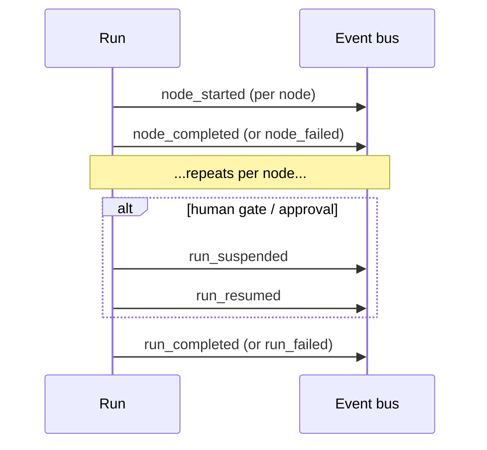

# Events and streams

Adriane exposes two distinct observation surfaces:

- **`RunEvent`** — the run lifecycle journal, one event per node/run transition, subscribed via
  [`CompiledGraph.onEvent`](/docs/reference/builder-api#oneventhandler). This is the **audit
  trail** the [execution contract](/docs/core-concepts/execution-contract) guarantees.
- **`StreamEvent`** — incremental run output, consumed by iterating
  [`CompiledGraph.stream`](/docs/reference/builder-api#streaminitialdata-mode-options).

They are different unions for different purposes. `RunEvent` is defined in
`packages/graph-runtime/src/types.ts`; `StreamEvent` and `StreamMode` in
`packages/graph-runtime/src/stream.ts`.

## RunEvent (the lifecycle journal)

Every transition emits exactly one event. If a transition happened, there is an event for it; if
there is no event, it did not happen.



The `RunEvent` union:

| `type` | Payload fields | Fires when |
| --- | --- | --- |
| `node_started` | `runId`, `nodeId`, `timestamp` | A node begins executing. |
| `node_completed` | `runId`, `nodeId`, `output`, `timestamp` | A node finishes successfully (`output` is its result). |
| `node_failed` | `runId`, `nodeId`, `error`, `attempt`, `timestamp` | A node throws (`error` is the message, `attempt` the retry count). |
| `run_suspended` | `runId`, `nodeId`, `reason`, `timestamp` | The run pauses cleanly — at a human gate, or an agent suspending for approval (`reason` carries why; `nodeId` is where it paused). |
| `run_resumed` | `runId`, `nodeId`, `timestamp` | A suspended run resumes from its latest checkpoint. |
| `run_completed` | `runId`, `finalState`, `timestamp` | The run reaches a terminal state (`finalState` is the full `GraphState`). |
| `run_failed` | `runId`, `error`, `timestamp` | The run fails irrecoverably (`error` is the message). |

All `timestamp` values are ISO strings; `runId` / `nodeId` are branded types from
`@adriane-ai/graph-core`.

```ts
const off = app.onEvent((event) => {
  if (event.type === "node_completed") {
    console.log(`${event.nodeId} done`, event.output);
  }
});
await app.run({});
off(); // unsubscribe
```

Expected result: prints one line per completed node, then unsubscribes.

:::note Events arrive identically across engines
On the Rust path, forwarded engine events are mirrored into the same event bus the TS path uses,
so `onEvent` subscribers see the same `RunEvent` stream regardless of engine. (Source:
`compiled-graph.ts` — the runner's `subscribe` re-emits into the shared bus.)
:::

## StreamEvent (incremental output)

`stream(initialData, mode, options?)` returns an `AsyncIterable<StreamEvent>`. The union:

| `type` | Payload fields | Meaning |
| --- | --- | --- |
| `state_value` | `state` | A full `GraphState` snapshot. |
| `state_update` | `delta`, `nodeId` | The channel-update map a node produced. |
| `message_delta` | `delta`, `nodeId`, `messageId` | A streamed token chunk for a message. |
| `tool_call` | `toolId`, `input`, `nodeId` | A tool invocation a node emitted. |
| `debug` | `payload`, `nodeId` | Arbitrary debug payload. |

### The four stream modes

`StreamMode` is one of `"values" | "updates" | "debug" | "messages"`
(`STREAM_MODES` in `stream.ts`):

| Mode | Emits | Use for |
| --- | --- | --- |
| `values` | `state_value` snapshots | Watching full state evolve. |
| `updates` | `state_update` deltas | Reacting to per-node channel writes. |
| `messages` | `message_delta` token chunks | Live chat-style token output. |
| `debug` | `debug` (and detailed) events | Tracing/diagnostics. |

```ts
for await (const event of app.stream({ name: "Ada" }, "updates")) {
  if (event.type === "state_update") {
    console.log(event.nodeId, event.delta);
  }
}
```

Expected result: prints one `state_update` per node as it writes — on **both** engines.

## Streaming is incremental on both engines

:::note Incremental on Rust too (ADR 0027 phase 4a)
`CompiledGraph.stream` is incremental on the Rust engine as well: the runner forwards each
run-lifecycle event in flight and `streamViaRust` projects them per node into the chosen mode —
`values` accumulates a snapshot per node step, `updates` emits a delta per node, `messages` emits a
`message_delta` per new message, `debug` carries every raw event. (Source: `compiled-graph.ts`
`streamViaRust`; proven by `stream.test.ts`, which asserts an intermediate snapshot before the
final.)
:::

The one piece **not** yet streamed through the bridge is **LLM token-level** deltas (per-token
output during a node) — deferred to ADR 0027 phase 4c. For token-by-token agent output today, use
the single-turn `streamAgentTokens(...)` helper (below), which streams straight through the gateway.
For per-transition observability the `RunEvent` journal via `onEvent` works identically on both
engines.

For token-by-token agent output specifically, the SDK also ships `streamAgentTokens(...)`, a
single-turn (no-tools) helper that streams text deltas straight through the LLM gateway —
independent of the graph stream surface.

## Next

- [Builder API](/docs/reference/builder-api)
- [Errors](/docs/reference/errors)
- [Observable runs](/docs/governance/observable-runs)
