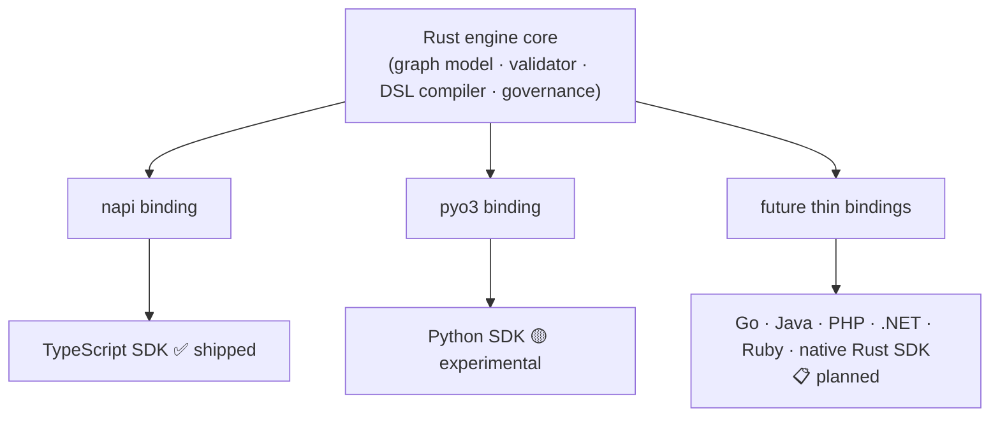

# Roadmap

Adriane is **0.1.0 — alpha**. This page is the honest ledger: what you can rely on today, what
exists but isn't proven, what is reserved in the schema but **not implemented**, and where the
project is headed. We'd rather under-promise here than have you discover a gap in production.

:::warning Alpha — read before you build on it
Treat anything not marked **Stable** as subject to change or absence. In particular, the
**Reserved** rows below have slots in the type system but **no runtime behaviour** — do not
design around them yet.
:::

## Feature status

Legend: **Stable** = relied on, contract-tested · **Experimental** = works, surface may change ·
**Reserved** = schema slot exists, **not implemented in the runtime**.

| Capability | Status | Notes |
| --- | --- | --- |
| Deterministic execution (named-predicate routing) | Stable | Conditions are names resolved in the `ConditionRegistry`, never `eval`'d. See [execution contract](/docs/core-concepts/execution-contract). |
| Checkpoint after every node + state mutation | Stable | `InMemoryCheckpointer` and `PgCheckpointer`. |
| Lifecycle events (`node_started` … `run_completed`/`run_failed`) | Stable | The event journal is the audit trail. |
| Suspend / resume + human gates | Stable | `run_suspended` / `run_resumed`; resume re-validates the checkpoint with Zod. |
| Governance: approval gates, separation of duties, Ed25519 attestation | Stable | Enforced at the control plane **and** independently in the Rust engine. See [governance](/docs/governance/governance-model). |
| Recursion limit | Stable | `RecursionLimitError` bounds cyclic runs. |
| One Rust engine + TypeScript SDK (`@adriane-ai/graph-sdk`) | Stable | The Rust engine (`@adriane-ai/napi`) is a **required** dependency. |
| TypeScript engine path (dev/test/uncovered platforms) | Stable | Not deprecated — it's the fallback when the native addon is absent. |
| Python SDK (`pip install adriane-ai` → `import adriane_ai`) | Experimental | JSON-in/JSON-out: validate, compile, model policy, component & prebuilt runs. **No custom Python nodes, no streaming** — by design. See [one engine, two languages](/docs/sdk-parity/one-engine-two-languages). |
| Adriane DSL (compile graph/agent/chain YAML) | Experimental | Compiles in both SDKs from the same Rust compiler. |
| Streaming runs | Experimental | TypeScript only today. |
| Rust incremental streaming | Reserved | The Rust path does not yet stream incrementally; streaming is a TS-SDK capability for now. |
| Parallel fan-out (`NodeDefinition.fanOut`) | Reserved | Schema slot only — **not executed** by the runtime. |
| Subgraph execution (`NodeDefinition.subgraphId`) | Reserved | Schema slot only — **not executed** by the runtime. |
| Durable timers / signals | Planned | Not present. See below. |
| Scalable worker fleet / server | Planned | A single BullMQ worker exists in the control plane; there is no managed, scalable fleet yet. |
| Polyglot SDKs beyond TS/Python (Go, Java, PHP, .NET, Ruby, native Rust) | Planned | The architecture is built for this; none are shipped. See below. |

:::note Reserved means absent
`fanOut` and `subgraphId` appear in `NodeDefinition` and the architecture
[overview](/docs/architecture/overview) calls them out explicitly: the slots are there so the
data model is stable, but **the runtime does not act on them**. A graph that sets them will not
fan out or descend into a subgraph today.
:::

## The vision

The bet behind Adriane is a single Rust core with **thin language bindings**, so the same engine
— same validator, same DSL compiler, same governance — can be driven from many languages without
a second implementation to drift.

### Polyglot SDKs

This is already real for two languages and is the clearest path forward:

The TypeScript SDK rides a [napi](/docs/architecture/napi-bridge) binding; the Python SDK rides a
pyo3 binding. The same pattern — a thin, JSON-shaped binding over the Rust core — is what makes
Go, Java, PHP, .NET, Ruby, and a native Rust SDK *tractable* rather than rewrites. They are
**planned, not shipped**; the design exists to make them additive.

### Durable timers and signals

Today a run suspends at a human gate and resumes from a checkpoint. The next step is
time-and-event-driven durability: **durable timers** (resume after a delay that survives process
restarts) and **signals** (resume on an external event), so a governed run can wait on the real
world without holding a process. This moves Adriane toward the durability properties that tools
like Temporal are known for — see [the comparison](/docs/introduction/comparison) for the honest
gap today.

### A scalable worker fleet / server

The control plane has a single BullMQ worker that drains a Redis queue. The roadmap is a
**managed, scalable fleet**: many workers, self-registration, heartbeating, graceful drain, and a
server that schedules governed runs across them durably.

### More integrations

A larger, curated catalog of **LLM providers** (via the gateway — the only layer allowed to
import provider SDKs) and **vector stores / retrievers** for the RAG pipeline. Breadth here is
deliberately behind [Haystack](/docs/introduction/comparison) today; closing some of that gap is
on the path, scoped to what stays governable and deterministic.

## How to read this page over time

Rows move **left to right** — Reserved → Experimental → Stable — only when there's runtime
behaviour and a contract test behind them. If a capability you need is Planned or Reserved, it is
not there yet, full stop. When in doubt, the [execution contract](/docs/core-concepts/execution-contract)
and the [architecture overview](/docs/architecture/overview) are the source of truth for what the
runtime actually does.

## See also

- [How Adriane compares](/docs/introduction/comparison) — vs LangGraph, Temporal, Haystack.
- [Architecture overview](/docs/architecture/overview) — including the reserved `fanOut`/`subgraph` slots.
- [One engine, two languages](/docs/sdk-parity/one-engine-two-languages) — the parity contract.
