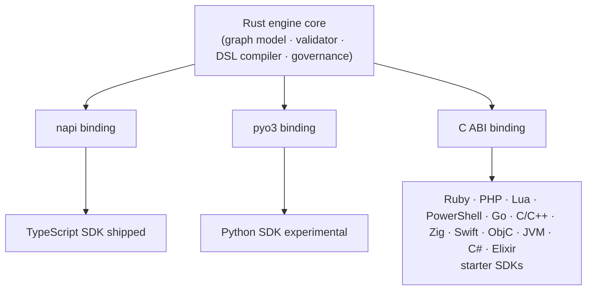

# Roadmap

Adriane is **1.0.0**. This page is the honest ledger: what you can rely on today, what exists
but isn't proven, and where the project is headed. We'd rather under-promise here than have you
discover a gap in production.

:::note 1.0.0
The Rust runtime now has parity with (and extends) the TypeScript runtime: concurrent fan-out,
subgraphs, incremental streaming, durable timers + external signals, dynamic-message `send`, and
the OKF + knowledge layer all landed in 1.0.0. Anything still marked **Experimental** or
**Planned** below is exactly that — don't design around a Planned row yet.
:::

## Feature status

Legend: **Stable** = relied on, contract-tested · **Experimental** = works, surface may change ·
**Reserved** = schema slot exists, **not implemented in the runtime**.

| Capability | Status | Notes |
| --- | --- | --- |
| Deterministic execution (named-predicate routing) | Stable | Conditions are names resolved in the `ConditionRegistry`, never `eval`'d. See [execution contract](/docs/core-concepts/execution-contract). |
| Checkpoint after every node + state mutation | Stable | The engine ships the `Checkpointer` interface + `InMemoryCheckpointer`. Durable Postgres checkpointing is **Adriane Studio** (commercial), not an open-SDK export. |
| Lifecycle events (`node_started` … `run_completed`/`run_failed`) | Stable | The event journal is the audit trail. |
| Suspend / resume + human gates | Stable | `run_suspended` / `run_resumed`; resume re-validates the checkpoint with Zod. |
| Governance: approval gates, separation of duties, Ed25519 attestation | Stable | The Rust engine enforces no-self-approval + attestation and emits lifecycle events; the SDK exposes the approval API (`humanGate` / `suspendForApproval` / `approveAndResume` / `onEvent`). Binding approvals to authenticated principals, persisting the audit journal, and the live view are a control-plane concern (**Adriane Studio**, or one you build on the SDK). See [governance](/docs/governance/governance-model). |
| Recursion limit | Stable | `RecursionLimitError` bounds cyclic runs. |
| One Rust engine + TypeScript SDK (`@adriane-ai/graph-sdk`) | Stable | The Rust engine (`@adriane-ai/napi`) is a **required** dependency. |
| TypeScript engine path (dev/test/uncovered platforms) | Stable | Not deprecated — it's the fallback when the native addon is absent. |
| Python SDK (`pip install adriane-ai` -> `import adriane_ai`) | Experimental | JSON-in/JSON-out: validate, compile, model policy, component & prebuilt runs. Custom Python nodes and streaming still need a PyO3 callback runtime. See [one engine, many languages](/docs/sdk-parity/one-engine-two-languages). |
| Adriane DSL (compile graph/agent/chain YAML) | Experimental | Compiles from the same Rust compiler across TypeScript, Python, and C-ABI SDKs. |
| Multi-provider LLM gateway (Anthropic, Gemini, OpenAI-compatible family, local) | Stable | Native Anthropic & Gemini + OpenAI-compatible OpenAI/OpenRouter/MiniMax/Hugging&nbsp;Face/Mistral + local Ollama/LM&nbsp;Studio; env-selected (BYOM). New in 0.2.0. See [Providers](/docs/building/providers). |
| Semantic retrieval (`semanticRetriever` component) | Experimental | Real-embedding cosine retrieval over a supplied corpus + query vector (vs the mock-embedding `retriever`). New in 0.2.0. |
| MCP server (tools + knowledge-base resources) | Experimental | Run agents/graphs as MCP tools and read a knowledge base as MCP resources, over stdio. New in 0.2.0. See [MCP server](/docs/building/mcp-server). |
| Streaming runs (four modes, incremental) | Stable | `values` / `updates` / `messages` / `debug` stream incrementally on the Rust engine and the TS path. New in 1.0.0. See [Streaming](/docs/building/streaming-and-events). |
| Parallel fan-out (`NodeDefinition.fanOut`) | Stable | Branches run **concurrently** off a shared pre-fan-out snapshot, merged in declared order (deterministic). New in 1.0.0. |
| Subgraph execution (`subgraph` nodes) | Stable | A subgraph node runs a registered child graph, maps channels in/out, and propagates child suspension. New in 1.0.0. See [Subgraphs](/docs/building/subgraphs). |
| Durable timers + external signals | Stable | `sleepUntil` / `waitForSignal` / `CompiledGraph.signal` — generalized suspend reasons; the engine stays clock-free (the scheduler is the control plane). New in 1.0.0. See [Durable timers and signals](/docs/building/durable-timers-and-signals). |
| Dynamic-message `send` / inbox (map-reduce) | Stable | Pre-queue per-node inputs (`RunOptions.inbox`), consumed FIFO via `__injected`. New in 1.0.0. See [Dynamic messages](/docs/building/dynamic-message-send). |
| Open Knowledge Format (`@adriane-ai/okf`) | Stable | Markdown + shallow-YAML frontmatter parser/serializer; byte-compatible TS + Rust. New in 1.0.0. See [OKF](/docs/knowledge/open-knowledge-format). |
| Knowledge base + graph (`@adriane-ai/knowledge`) | Stable | KB/KG model, pure graph ops, and the `KnowledgeStore` seam (+ in-memory). New in 1.0.0. See [Knowledge base and graph](/docs/knowledge/knowledge-base-and-graph). |
| Control plane, worker fleet & governance UI | Adriane Studio (commercial) | The control-plane API, the BullMQ worker fleet, durable Postgres checkpointing, and the governance Studio UI are **Adriane Studio**, the managed platform — not part of this open engine repo. The engine is a library you embed; there is no server to run for the engine itself. |
| Polyglot SDKs beyond TS/Python | Experimental | C-ABI starter SDKs exist for Ruby, PHP, Lua, PowerShell, Go, C, C++, Zig, Swift, Objective-C, Java, Kotlin, Scala, C#, and Elixir. The ABI exposes callback-neutral helpers plus callback-capable run/resume/approve/signal/replay; idiomatic builders and typed helpers are the remaining SDK work. |

:::note Now executed
`fanOut` and `subgraphId` were schema-only slots in earlier releases; as of 1.0.0 the runtime
**executes both** — concurrent deterministic fan-out and subgraph nodes. See
[Subgraphs](/docs/building/subgraphs).
:::

## The vision

The bet behind Adriane is a single Rust core with **thin language bindings**, so the same engine
— same validator, same DSL compiler, same governance — can be driven from many languages without
a second implementation to drift.

### Polyglot SDKs

This is now real for TypeScript, Python, and C-ABI starter SDKs:

The TypeScript SDK rides a [napi](/docs/architecture/napi-bridge) binding; the Python SDK rides a
pyo3 binding; the newer polyglot SDKs ride the shared [C ABI](/docs/sdk-parity/polyglot-c-abi).
That keeps Go, Java/Kotlin/Scala, PHP, .NET, Ruby, Lua, PowerShell, Swift, Objective-C, Zig, C++,
and Elixir additive wrappers instead of rewrites. The current shared surface is JSON/YAML
validation, compilation, model policy, catalogs, native components, and prebuilt-agent runs; the
callback runtime is the remaining bridge for full TypeScript feature parity.

### Durable timers and signals — delivered in 1.0.0

A run suspends at a human gate, a **durable timer**, or an **external signal**, and resumes from
a checkpoint. The engine stays clock-free: `wakeAt` is data and the *scheduler* (the control
plane) resumes a timer run when due, while `CompiledGraph.signal(runId, name, payload)` resumes a
signal wait on an external event — so a governed run can wait on the real world without holding a
process. See [Durable timers and signals](/docs/building/durable-timers-and-signals). This brings
Adriane the time-and-event-driven durability that tools like Temporal are known for; the
remaining control-plane piece (a scheduler that calls `resume` at `wakeAt`) is **Adriane Studio**.

### The managed platform: Adriane Studio

The engine in this repo is a **library you embed** — there is no server to run for the engine
itself. Like Temporal separates the open SDK from the Temporal Service/Cloud, Adriane separates
this open engine from **Adriane Studio**, the managed control plane: durable Postgres
checkpointing, a scalable worker fleet (self-registration, heartbeating, graceful drain), and the
governance Studio UI (live view, audit journal, approvals bound to authenticated principals).
Studio's code is **not** in this repo. If you'd rather build your own control plane, the SDK gives
you everything you need: the `Checkpointer` interface, the approval API (`humanGate` /
`suspendForApproval` / `approveAndResume`), and `onEvent` for the lifecycle stream.

### More integrations

A larger, curated catalog of **LLM providers** (via the gateway — the only layer allowed to
import provider SDKs) and **vector stores / retrievers** for the RAG pipeline. Breadth here is
deliberately behind [Haystack](/docs/introduction/comparison) today; closing some of that gap is
on the path, scoped to what stays governable and deterministic.

## How to read this page over time

Rows move **left to right** — Reserved → Experimental → Stable — only when there's runtime
behaviour and a contract test behind them. If a capability you need is Planned or Reserved, it is
not there yet, full stop. When in doubt, the [execution contract](/docs/core-concepts/execution-contract)
and the [architecture overview](/docs/architecture/overview) are the source of truth for what the
runtime actually does.

## See also

- [How Adriane compares](/docs/introduction/comparison) — vs LangGraph, Temporal, Haystack.
- [Architecture overview](/docs/architecture/overview) — including the reserved `fanOut`/`subgraph` slots.
- [One engine, many languages](/docs/sdk-parity/one-engine-two-languages) — the parity contract.
